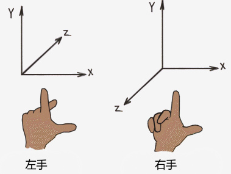
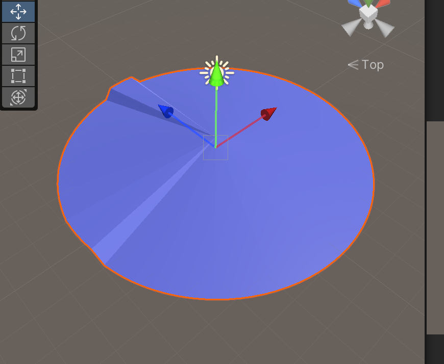
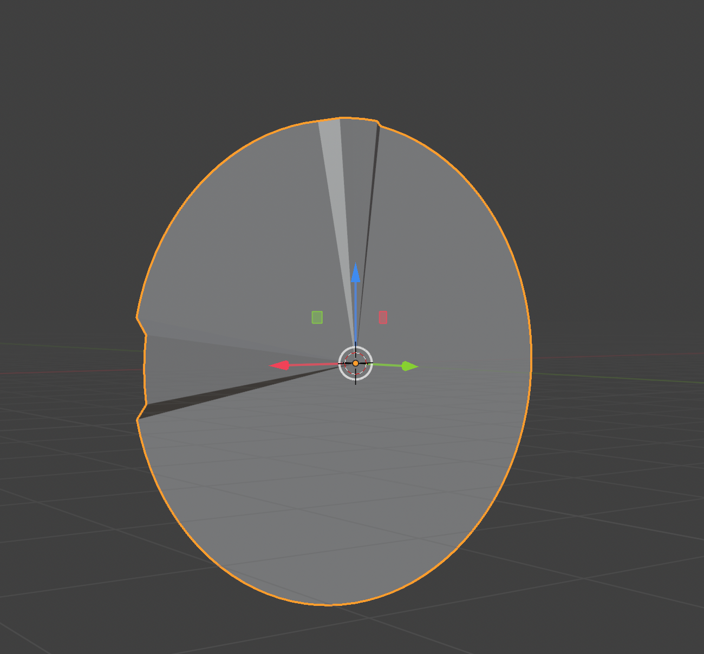
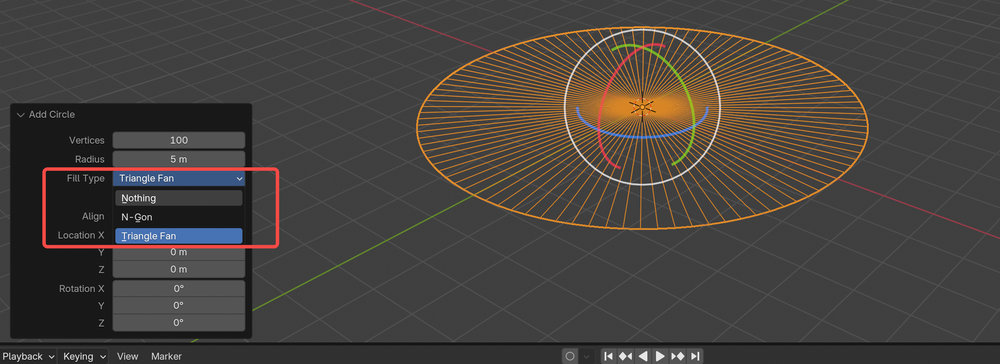
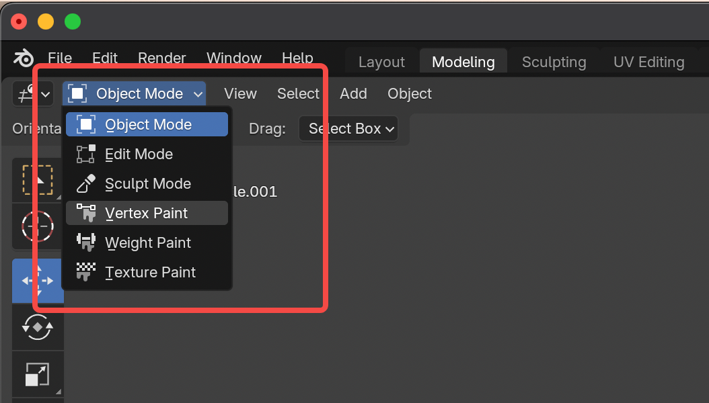
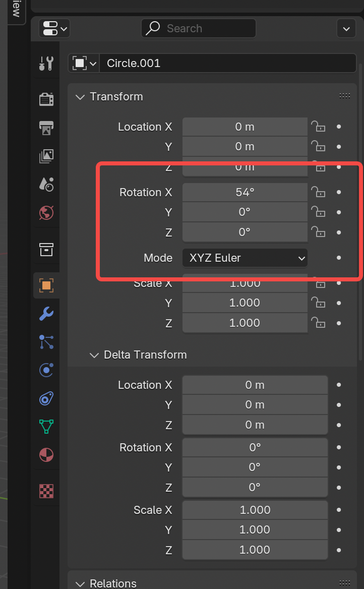
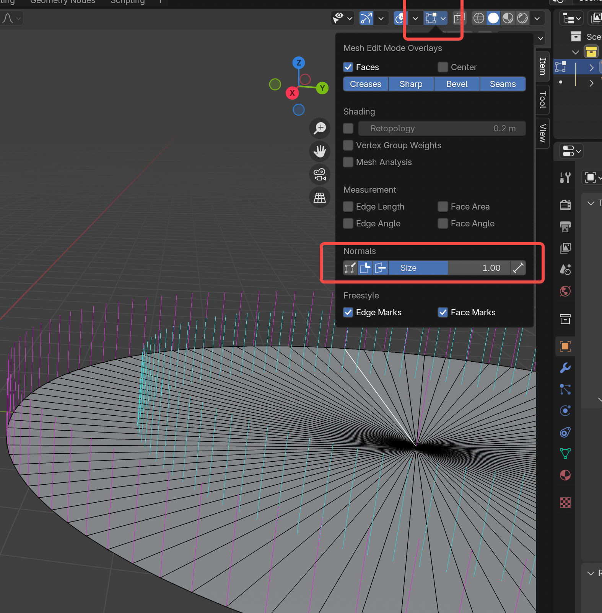

起因是2025GGJ的主题是Bubble,想在Unity中做一个吹泡泡的游戏,需要用一个圆来表现泡泡波动的状态.遂打开Blender准备导出一个圆片到Unity中.本文记录为了导出一个能在Unity中正确使用的圆,用到的Blender中的功能和技巧.

# Blender中的坐标系

Blender中的坐标系是右手坐标系,Unity中的坐标系是左手坐标系,判断左右手坐标系通过手性判断:

可以看下面两张图,展示了同一个模型在Unity和Blender中坐标轴的关系,两种坐标系下x轴的正方向反过来了,其他两个轴在之后x轴方向翻转的情况下是一致的.两个图中的坐标系都是Local坐标系.

# Blender中常用的快捷键

`Shift + A` 在场景中快速添加一些组件
`Shift + Z` 切换Viewport类型 比如是线框、着色等
`鼠标右键` 取消之前触发的命令
`G` 移动选中的物体

# 在Blender中制作一个圆形的实心平面

Shift + A 创建一个Circle的Mesh,这是发现即便是在着色视口下,Circle仍然只有一个线框,这是因为这些顶点没有构成一个个的三角形,需要设置这个Circle的填充属性,当你创建出来一个Circle之后,不要乱动,你会发现左下角有一个AddCircle的小Widget,点击这个组件或者按键盘`F9`会展开弹窗,在弹窗中修改FillType为TriangleFan,另外你也可以调整创建出来的圆片的顶点数和半径

# 更改模型的轴向

笔者已经在Unity中搭建好了一个摄像机朝向为y轴负方向的游戏场景,所以要在Blender里面创建一个正面朝向模型本地坐标系y轴正方向的圆片模型,在Blender中,左上角上会有一个选择当前模式的按钮,笔者本次用到了ObjectMode和EditMode,在ObjectMode下,选中圆片进行旋转,你会发现旋转信息都会被记录在Transform的属性中,也就是说这个圆片模型的本地坐标系也是在跟着旋转的,这个操作是没有意义的.
我们需要切换到EditMode,框选所有的顶点,围绕X轴,沿着右手坐标系定义的x轴的逆时针方向,**注意是逆时针方向**旋转90度,你会发现Blender并没有计算这次操作的旋转角度,我们这次操作直接修改了所有顶点的位置信息.在旋转过程中按住`Shift`可以微调旋转度数.

# 如何在Blender中区分正面和反面

在EditMode下,视口右上角图标点击窗口中可以显示当前选中模型的法线朝向,法线指向的方向即是该面的正面

上面我们说过,Unity和Blender中模型的本地坐标系的差别是x轴的方向翻转了,举一反三:想要导出一个在Unity中正面朝向Unity坐标系下x轴正方向的圆片模型,那么需要在Blender中让这个圆片的法线朝向Blender中该模型本地坐标系的x轴的负方向就可以了.

最后,一些细枝末节,如果在Blender中以Rotation X为0导出到Unity中,在Unity的Import窗口中会看到模型的local Rotation属性为-90,在Blender中以RotationX 90导出就没问题了