# 背景

本文主要记录了JDK、JRE、JVM的区别、在Mac和Windows上配置Java开发环境、创建并运行最简单的Java程序以及如何将单个java文件导入`IntelliJ IDEA`中运行

# JDK JRE JVM的区别与联系

## 什么是JDK？

JDK是Java Development Kit，JDK是用于制作程序和Java应用程序的软件开发环境。Java开发人员可以在Windows、MacOS、Linux上使用，是一个跨平台的编程语言。JDK可以帮助他们编写和运行Java程序，可以在同一台计算机上面安装多个版本的JDK。

## 什么是JRE？

JRE是Java Runtime Environment。JRE是一个旨在运行其他软件的软件，它包含类库、加载器类和JVM。简单来说，如果想要运行Java程序，我们就需要JRE，如果我们只是一个一般的用户，就不需要安装JDK，只需要安装JRE来运行Java程序即可，不过所有的JDK版本都与JRE捆绑在一起，因此无需在PC单独下载和安装JRE。

## 什么是JVM？

JVM是Java Virtual Machine。JVM是一个引擎，它提供运行时环境驱动Java代码或者应用程序，它将Java字节码转换成机器语言，JVM是Java运行环境（JRE）的一部分，它不能单独下载和安装。要安装JVM，需要安装JRE。

## 小节

- JDK是一个软件开发工具包，而JRE是一个允许Java程序运行的软件包，JVM则是一个执行字节码的环境。
- JDK的全称是Java Development Kit，JRE的全称是Java Runtime Environment，而JVM的全称是Java Virtual Machine。
- JDK 是平台相关的，JRE 也是平台相关的，但是 JVM 不是平台相关的。
- JDK 包含开发、调试等工具。JRE 包含类库和其他支持文件，而软件开发工具不包含在 JVM 中。
- JDK 附带安装程序，另一方面，JRE 仅包含执行源代码的环境，而 JVM 捆绑在软件 JDK 和 JRE 中。

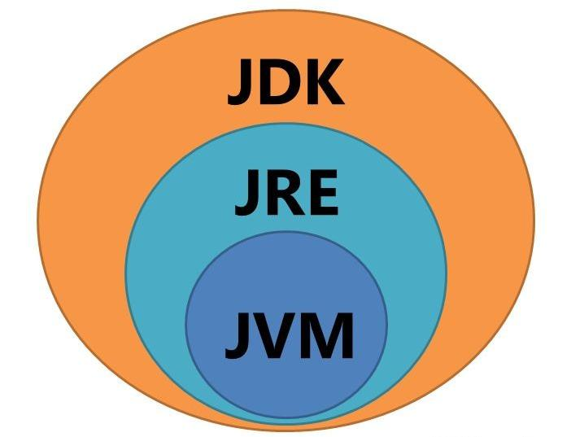

# JDK的文件目录

在JDK1.8之前，JDK的文件目录如下：

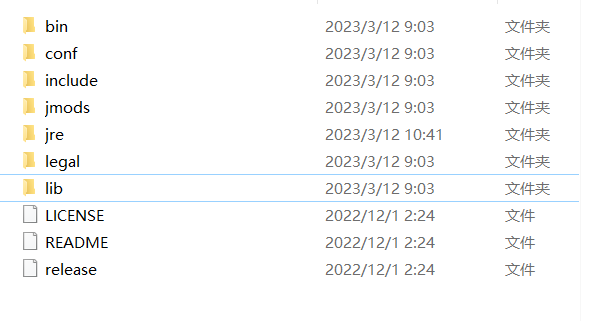

一些重要的文件夹的作用解释如下：

- **bin**: 该路径下存放了JDK的各种命令，常用的javac、java等。

- **include**: 一些平台特定的头文件，支持Java本地接口和Java虚拟机调试程序接口的本地编程技术。

- **jre**: 运行java程序所必须的JRE环境。

- **lib**：JDK工具命令的实际执行程序，bin路径下的绝大部分命令都是包装了tools.jar如（lib->tools.jar->sun\tools\javac\Main.class javac命令的实际执行类；bin下的javac.exe命令实际上仅仅包装了这个Java类）。

但在1.8版本之后，在安装JDK的时候就不带有`jre`这个文件夹了，具体原因并不清楚，但是在目前的使用中jre文件夹的缺失并没有造成什么影响，不过为了保持JDK的完整性，我还是要将jre添加到jdk的目录下。

无论是Mac还是Windows都先进入到JDK的根目录下，然后分别在终端中输入以下指令：

Windows下需要输入:

```shell
bin\jlink.exe --module-path jmods --add-modules java.desktop --output jre
```

Mac下需要输入

```
./bin/jlink --module-path jmods --add-modules java.desktop --output jre
```

执行完上面的指令，jre就添加到JDK的文件夹里面了。

# Mac上配置JDK

Arm架构的Mac和X86架构的Mac安装的JDK是不一样的，这是JDK的[下载地址](https://www.oracle.com/java/technologies/downloads/#java11-mac)，我们要选择MacOS下的`Arm 64 Compressed Archive`进行下载。	

下载完成之后，打开终端并输入：

```shell
vim ~/.bash_profile
```

打开文件后输入以下内容：

```she
# 配置JDK11 环境变量 
# JAVA_HOME：JDK安装路径（修改成你自己的）
export JAVA_HOME=/Library/Java/JavaVirtualMachines/jdk-11/Contents/Home
# $JAVA_HOME/bin 下面是JDK的各种命令  
export PATH=$JAVA_HOME/bin:$PATH:.

```

输入`source ~/.bash_profile`使刚才配置的文件生效，接着输入`java -version`查看JDK是否安装成功 。到这里还没有结束，如果我们重启终端再输入`java -version`是会报错的，原因是重启后的终端并没有让`.bash_profile`配置文件生效，所以我需要在终端中执行`vim ~/.zshrc`，在最后一行添加`source ~/.bash_profile`，保存后退出，然后执行`source ~/.zshrc`，这样就可以让终端每次启动的时候自动将`./bash_profile`配置文件生效。

# 在Windows上配置JDK环境

使用这个[下载地址](https://www.oracle.com/java/technologies/downloads)下载Windows版本的JDK。

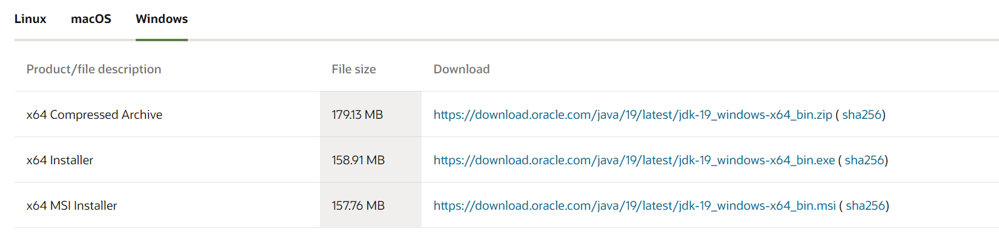

下载列表中有一个`Compressed Archive`和一个`installer`，二者的区别是：`Compressed Archive`只会下载jdk的文件，需要我们手动去配置环境，配置的方法稍后会提及，先说`installer`是什么：`installer`下载的是一个安装器，会帮助我们将`Compressed Archive`中下载的jdk文件安装到指定路径。并且环境变量中会自动生成一条变量：

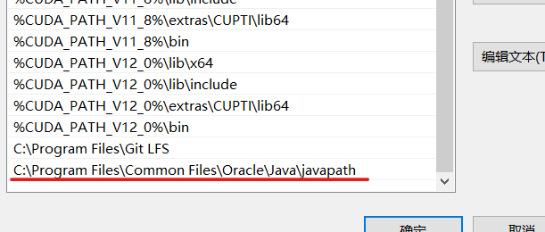

在这种情况下直接打开终端，`java`和`javac`命令都是可以直接使用的,这是因为`installer`在为我们安装jdk的时候也将这些工具复制到了这个路径下。

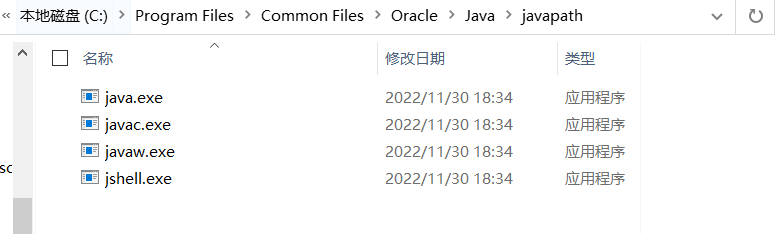

通过installer的方法虽然说也可以完成jdk的安装，但是和手动配置jdk从自由度上来讲还是有差别的，下面介绍如何使用`Compressed Archive`来配置jdk。

这是我jdk的存放路径：

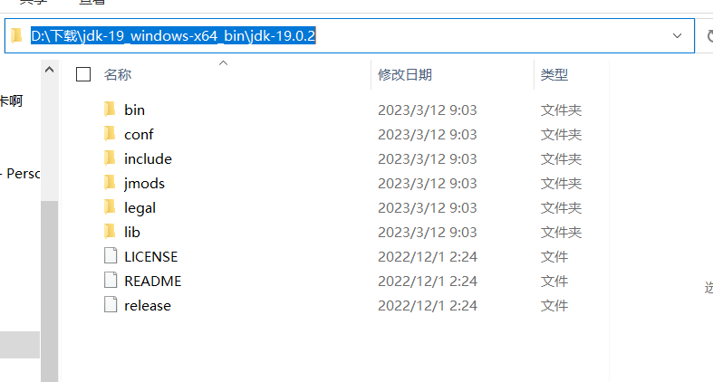

我们打开环境变量，创建两个新的系统变量：`JAVA_HOME`和`CLASSPATH`，变量值如下：

```shell
#具体值需要按照不同的版本和设备做修改
D:\下载\jdk-19_windows-x64_bin\jdk-19.0.2
.;%JAVA_HOME%\lib\dt.jar;%JAVA_HOME%\lib\tools.jar
```

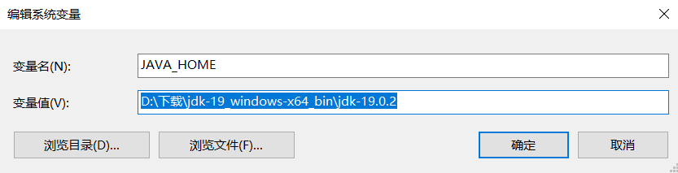

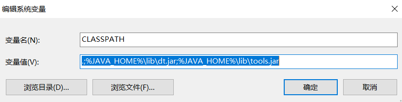

最后在环境变量中找到Path，新建下面两个变量

```shell
D:\下载\jdk-19_windows-x64_bin\jdk-19.0.2\bin
D:\下载\jdk-19_windows-x64_bin\jdk-19.0.2\jre\bin
```

添加完成之后重启终端，输入`java`，看到如下信息代表配置成功了。 

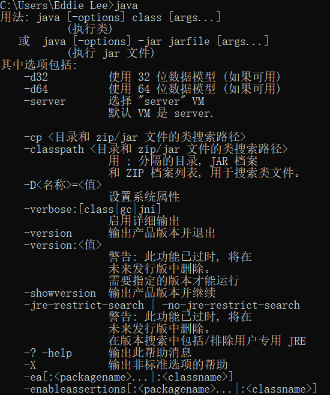

# 在Mac和Windows上不借助任何IDE运行Java脚本

<span id = "1">我们现在只会用到两个命令`java`和`javac`，我们编写一个`hello.java`文件，注意文件名要和类名一样：</span>

```java
public class hello{
  
  // main函数的拼写都是小写的，大小写敏感
  public static void main(String[] args){
    System.out.println("HelloWorld!");
  }
}
```

然后我们在终端中依次执行：

```shell
# javac命令会将.java文件编译成class文件
javac hello.java
# java命令会运行class文件
java hello
```

# 使用IntelliJ IDEA打开并运行java文件

## 背景

我使用记事本或者`Sublime`等Text Editor编写了一个java文件，我想要在IDEA中运行这个java程序，我该怎么做？

## IntelliJ IDEA中java项目的文件结构

我先使用IDEA创建一个非常简单的Java项目，项目的文件目录结构如下：

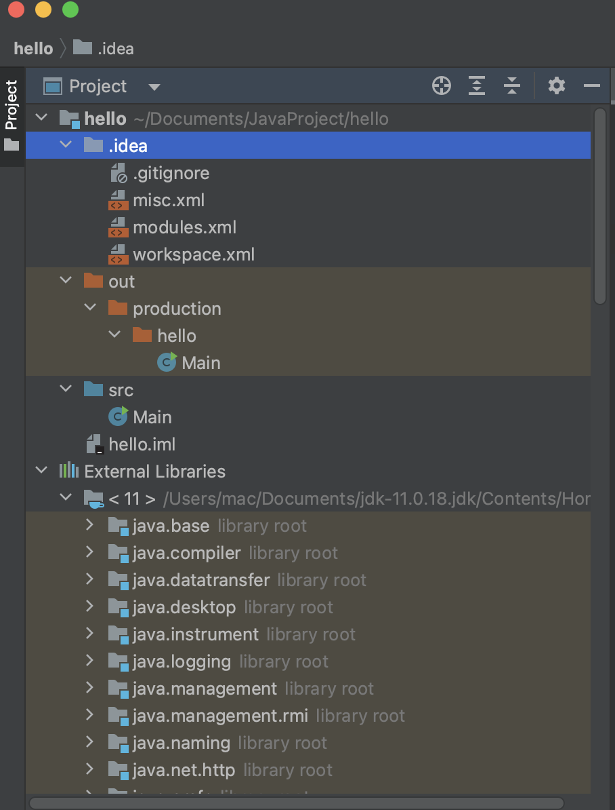

- `.idea`目录和`iml`文件是IDEA的配置文件，可以隐藏
- `src`目录是代码源文件存放的目录
- `out`是Java程序的输出目录，存放字节码文件
- `external Libraries`是JDK的扩展类库

## 使用IDEA运行单个java程序

想要使用IDEA运行java项目，就需要这个项目能够符合IDEA项目的文件结构，有两种方法可以将单个java文件放入IDEA中运行：

**方法一**

在IDEA中选择`File`->`Open`->打开java文件所在的文件夹

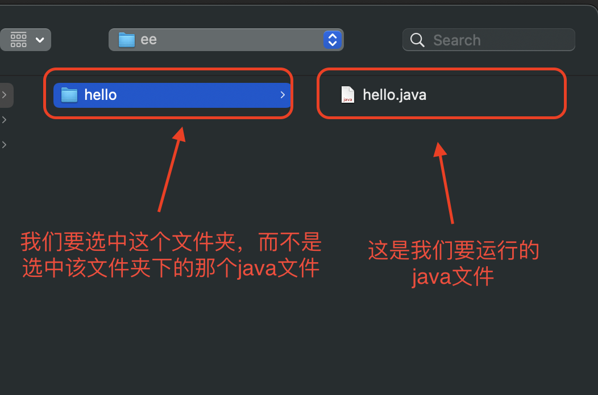

打开文件夹后点击`File`->`Project Structure`，为项目配置`jdk`和`output`文件夹，点击Apply，返回项目就可以运行了。

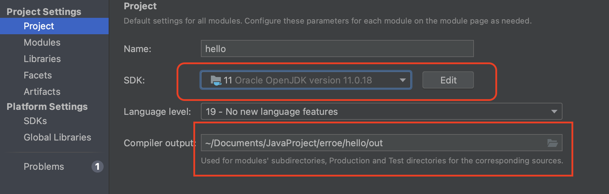

**方法二**

直接在IDEA中新建项目，选择不勾选添加示例代码。

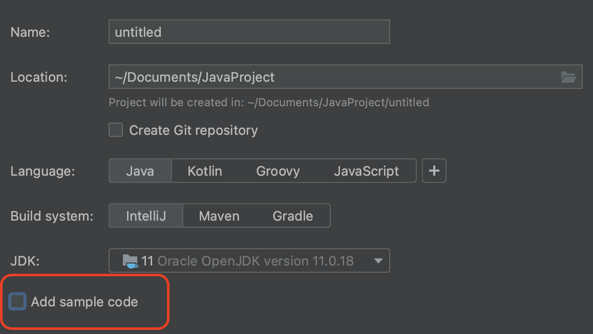

项目打开后将想要运行的java代码拖到src中去，然后就可以运行了。

# Java:main()函数的一些知识点

上文中已经展示了一个[最简单的Java程序](#1)，`main`函数的前面有两个属性：`public`和`static`，两个属性是必须要有的，否则Java程序将无法正常运行。

## 为什么要static

Main方法是Java程序的入口，JVM会查找类中的`public static void main(String[] args)`，如果找不到该方法就会抛出错误`NoSuchMethodError:main`终止程序Main方法必须严格遵循它的语法规则，方法签名必须是public static void，参数类型是String类型，在Java1.5以及以后的版本还可以使用可变的参数：`public static void main(String ... args)`。

JVM调用main方法的以后不需要创建任何包含这个main方法的实例，如果main方法不声明为静态的，JVM就必须创建main类的实例，因为构造器可以被重载，JVM没办法确定调用的是哪个main方法。静态方法和静态数据加载到内存中就可以直接调用而不需要像实例方法一样创建实例后才可以被调用，如果main方法是静态的，那么它就会被加载到JVM上下文中成为可执行的方法。

## 为什么要public

Java指定了一些可访问的修饰符，比如private、protected、public，任何方法或者变量都可以声明为public，Java可以从该类之外的地方访问。因为main方法是公共的，JVM就可以轻松的访问和执行它。

### 为什么是void

因为main返回任何值对程序都没有任何意义，所以设置成void。

