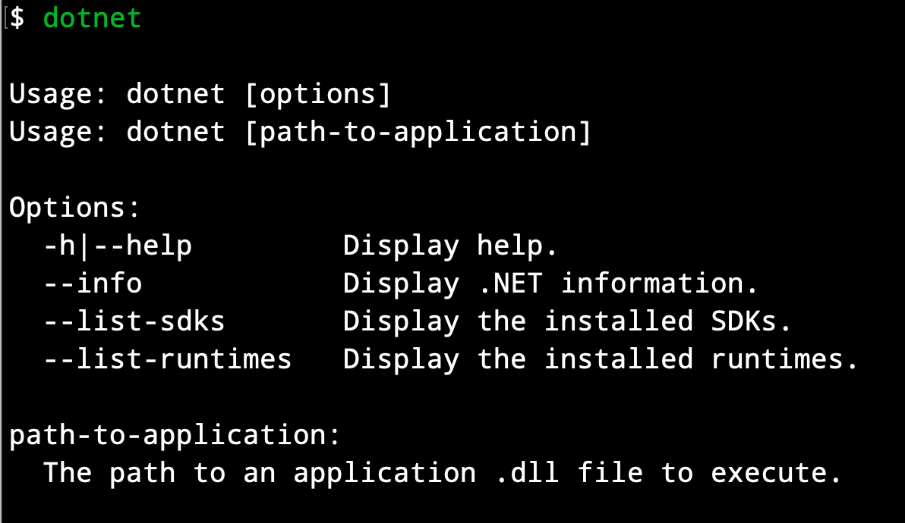
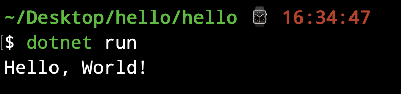

# 背景

本文主要记录如何配置.NET环境，以及如何创建最简单的C# application。

# 在Mac上配置dotNet开发环境

这里是.Net7的[下载地址](https://download.visualstudio.microsoft.com/download/pr/86bb5988-5fb5-4e22-8f21-de5992e1a689/f8f616f84dc38100a8464c4644a371ce/dotnet-sdk-7.0.201-osx-arm64.pkg)，打开下载的pkg，按照指引完成安装。在终端中输入`dotnet`，如果安装成功，会弹出如下内容：



# 使用Terminal创建一个最简单的C#命令

在终端中输入：

```shell
dotnet new console -o MyApp -f net7.0
cd MyApp
```

上述各命令的解释：

- `dotnet new conslole` 命令用来创建新的console APP 
- -`o`参数会创建名为`MyApp`的目录，用于存储应用并使用所需文件进行填充
- `-f`参数指示console我们创建的是.NET7的应用程序

创建的MyApp文件夹中的主文件称为`Program..cs`，默认情况下，它包含的内容如下：

```c#
Console.WriteLine("Hello World!");
```

然后在终端中运行`dotnet run`来运行`.NET`应用，终端中会输出如下结果：



## 使用Rider打开并运行C#项目

使用Rider打开并运行C#项目不像使用IDEA打开并运行java代码那样繁琐，直接在Rider中选择`File`->`Open`，选择你使用Terminal创建的C# application打开，就可以在Rider中运行项目了。

# 在Windows上配置dotNet开发环境

Windows上安装dotNet的方式多种多样，而且官方的教程也很详细，可以直接看[官网教程](https://learn.microsoft.com/zh-cn/dotnet/core/install/windows?tabs=net70)
