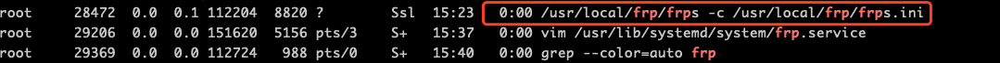

今天花了一天的时间，才把内网穿透给搞好了，这次把步骤好好记下来，下次再需要重新配置可以有个参照。

## 我需要用内网穿透做什么？

我寝室里有一台iMac，还有一台macbook。我在两台设备上都有编辑博客的需求，但如果在两台设备上都部署博客会比较混乱，比如iMac上存有博客a、b、c，macbook上存有d、e、f。所以我想只用iMac来打包部署，平时带着笔记本在外面写好了博客之后，用内网穿透把编辑好的博客发到iMac上，然后在iMac上打包部署到云服务器上，这样就不会乱了。

## 搭建步骤

我们需要现在github上把需要的frp版本下载下来

我的Mac都是M1版本的，所以下载`arm64`版本。

使用`uname -a`查看你的云服务器的架构，我的是`x86`，所以下载`amd64`版本

另外，我用的ssh工具是`Termius`。

mac版本：[https://github.com/fatedier/frp/releases/download/v0.39.1/frp_0.39.1_darwin_arm64.tar.gz]()

linux版本：[https://github.com/fatedier/frp/releases/download/v0.39.1/frp_0.39.1_linux_amd64.tar.gz]()

1. 服务器端
   
   我们可以在本地下载好服务器版本的frp，然后用`Termius`的文件传输功能把文件传送给服务器，这样比较快。
   
   传送到根目录下，使用解压命令：
   
   ```shell
   tar -zxvf frp_0.39.1_linux_amd64.tar.gz
   ```
   
   将解压出来的文件夹改名问frp，然后进入frp
   
   ```shell
   cd frp
   #进入之后我们需要对frps.ini配置文件做更改
   #frpc*开头的文件我们都不需要，可以删掉
   ```
   
   如果你的需求只是远程操控设备传输文件的话，那么采用默认的配置就可以了，什么都不用动
   
   ```shell
   vim frps.ini
   ```
   
   ```shell
   [common]
   bind_port = 7000       
   #默认的就可以，什么都不用动                                             
   ```
   
   **运行frp**
   
   ```shell
   ./frps
   #注意要在frp目录下
   ```
   
   **开启自启动frp**
   
   1. 添加systemd配置文件
      
      ```shell
      vim /usr/lib/systemd/system/frp.service
      ```
      
      文件内容如下：
      
      ```shell
      [Unit]
      Description=The nginx HTTP and reverse proxy server
      After=network.target remote-fs.target nss-lookup.target
      
      [Service]
      Type=simple
      ExecStart=/root/frp/frps -c /root/frp/frps.ini
      KillSignal=SIGQUIT
      TimeoutStopSec=5
      KillMode=process
      PrivateTmp=true
      StandardOutput=syslog
      StandardError=inherit
      
      [Install]
      WantedBy=multi-user.target
      ```
      
      ExecStart的内容请根据自己frp安装目录修改。
   
   2. 设置开机启动
      
      ```shell
      systemctl daemon-reload
      systemctl enable frp
      ```
   
   3. 启动frp
      
      ```shell
      systemctl start frp
      ```
   
   4. 查看frp是否启动
      
      ```shell
      ps aux | grep frps
      ```
      
      
      
      看到如上结果，代表frp启动成功

2. 客户端
   
   我们先把frp文件下放在用户根目录下，然后配置frpc.ini文件如下
   
   ```shell
   [common]
   server_addr = 139.224.82.218
   server_port = 7000
   ```
   
   [ssh]
   type = tcp
   local_ip = 127.0.0.1
   local_port = 22
   remote_port = 6000

```
server_addr是服务器的ip地址

server_port是frp应用占用的端口

我使用macbook访问服务器的6000端口，frp就会把这个端口映射成iMac的22端口。

**设置Mac上frp开启启动**

1. 终端执行

   ```shell
   sudo vim /Library/LaunchDaemons/frpc.plist
```

2. 追加并保存内容
   
   ```shell
   <?xml version="1.0" encoding="UTF-8"?>
   <!DOCTYPE plist PUBLIC "-//Apple//DTD PLIST 1.0//EN" "http://www.apple.com/DTDs/PropertyList-1.0.dtd">
   <plist version="1.0">
   <dict>
       <key>Label</key>
       <string>frpc</string>
       <key>ProgramArguments</key>
       <array>
           <string>/Users/jonathan/frpc/frpc</string>//替换为自己的frpc执行程序路径,并移除当前注释 
           <string>-c</string>
           <string>/Users/jonathan/frpc/frpc.ini</string>//替换为自己的frpc.ini配置路径,并移除当前注释 
       </array>
       <key>KeepAlive</key>
       <true/>
       <key>RunAtLoad</key>
       <true/>
   </dict>
   </plist>
   ```

```
3. 加入启动项

```shell
sudo chown root /Library/LaunchDaemons/frpc.plist
sudo launchctl load -w /Library/LaunchDaemons/frpc.plist
```

   **取消frp自启动**

```shell
sudo launchctl unload -w /Library/LaunchDaemons/frpc.plist
```

3. 使用MacBook内网穿透iMac

使用Termius新建一个HOST

注意Address还是填服务器的IP，不要加冒号和端口号

在SSH栏下面的Port中，将默认的22端口改成remote_port设置的值

UserName是你iMac的用户名，密码也是对应用户名的密码，不是云服务器的！！

完结撒花。
