-6521847.jpg)

<!--more-->

# 设计任务与要求

1. 设计任务：设计高校学籍管理系统
2. 设计要求
   - 实现学生信息、班级、院系、专业等的管理
   - 实现课程、学生成绩信息管理
   - 实现学生的奖惩信息管理
   - 实现学生、班级、成绩等相关信息的查询统计等
   - 创建规则用于限制性别项只能输入“男”或“女”
   - 创建视图查询各个学生的学号、姓名、班级、专业、院系
   - 创建存储过程查询指定学生的成绩单
   - 创建触发器当增加、删除学生和修改学生班级信息时自动修改相应班级学生人数
   - 具有数据备份和恢复功能
3. 课设验收主要参考指标
   - 需求分析
   - 数据库设计，逻辑结构均达到3NF，考虑性能优化
   - 数据库完整性，制定自己的完整性约束规则
   - 安全性，必须要有基本的用户及其权限的控制手段，数据库的备份和恢复
   - 视图
   - 触发器
   - 存储过程
   - 索引
   - 系统功能
   - 用户界面友好性

# 开发记录

## 配置IDEA开发环境

### 创建JavaWeb项目

#### 新建一个JavaProject

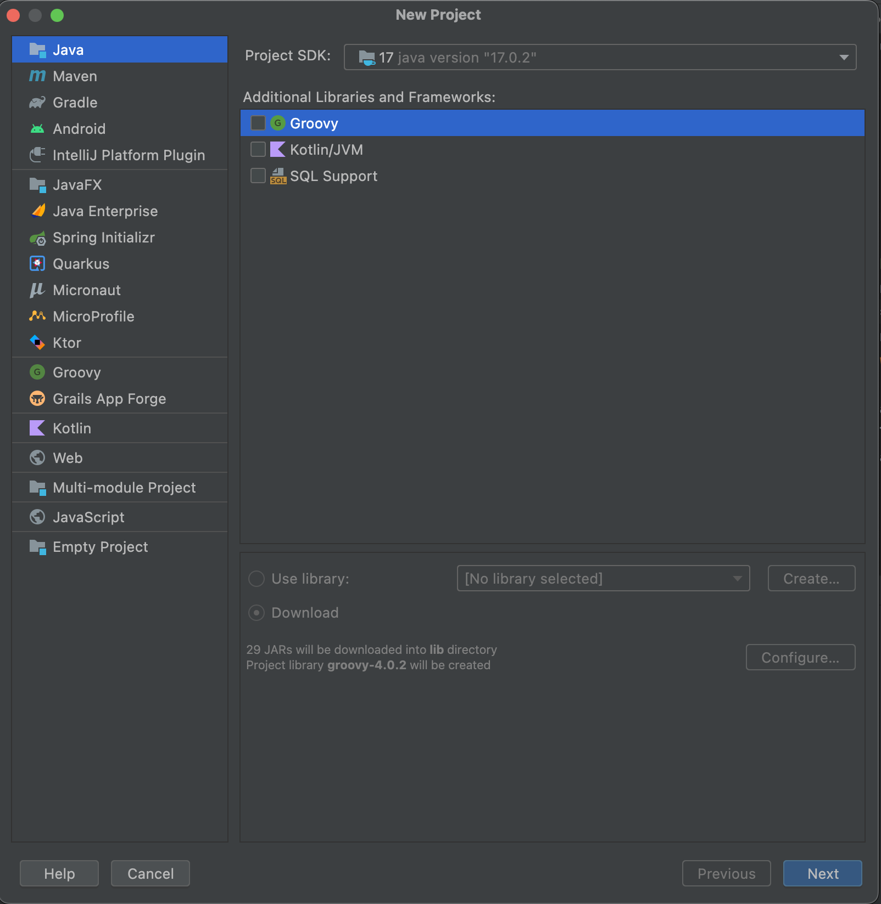

#### 添加Web Application组件

在新建的项目上右键，选择 Add Frameworks Support，选择 Web Application，点击OK。

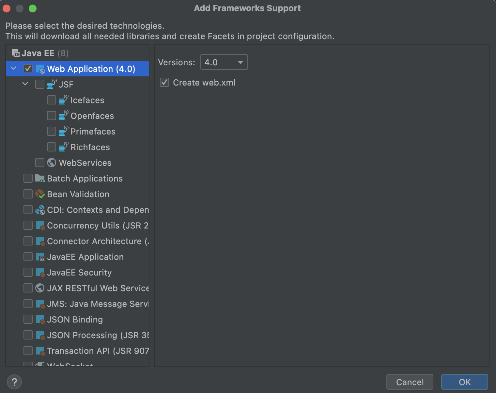

### 导入jar包

#### 导入连接数据库的jar包 

mysql-connecter-java-8.0.27.jar

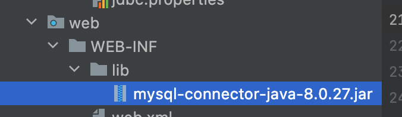

#### 导入tomcat的jar包

jsp-api.jar和servlet-api.jar

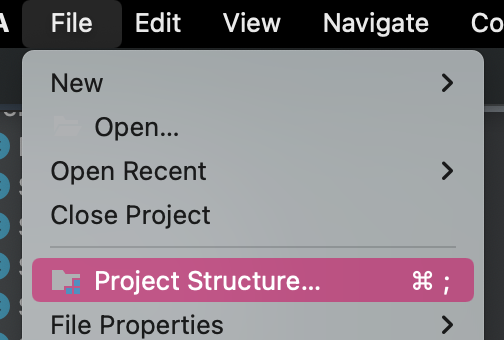

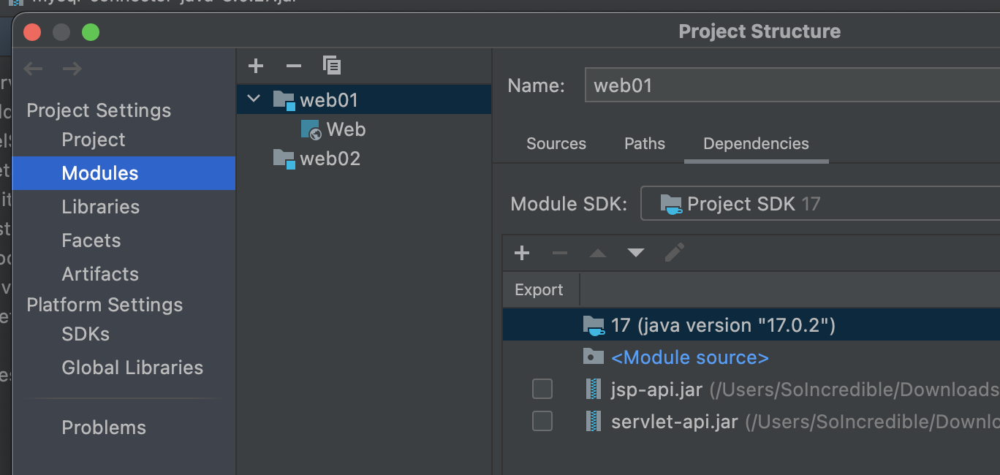   

### 配置tomcat服务器

#### Tomcat版本与Java版本的关系

- JavaEE目前最高版本是 JavaEE8
- JavaEE被Oracle捐献了，Oracle将JavaEE规范捐献给Apache了。
- Apache把JavaEE换名了，以后不叫JavaEE了，以后叫做 jakarta EE。
- 以后没有JavaEE了。以后都叫做Jakarta EE。
- JavaEE8版本升级之后的"JavaEE 9"，不再是"JavaEE9"这个名字了，叫做JakartaEE9
- JavaEE8的时候对应的Servlet类名是：javax.servlet.Servlet
- JakartaEE9的时候对应的Servlet类名是：jakarta.servlet.Servlet （包名都换了）
- 如果你之前的项目还是在使用javax.servlet.Servlet，那么你的项目无法直接部署到Tomcat10+版本上。你只能部署到Tomcat9-版本上。在Tomcat9以及Tomcat9之前的版本中还是能够识别javax.servlet这个包。

#### IDEA中配置Tomcat服务器

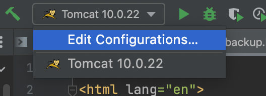

在IDEA右上角选择Edit Configurations，添加Tomcat Server Local

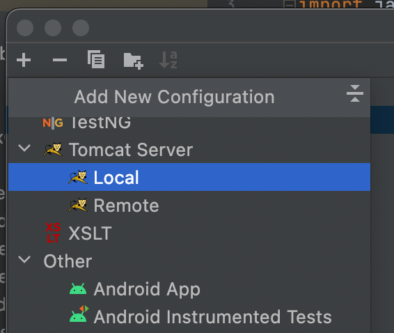

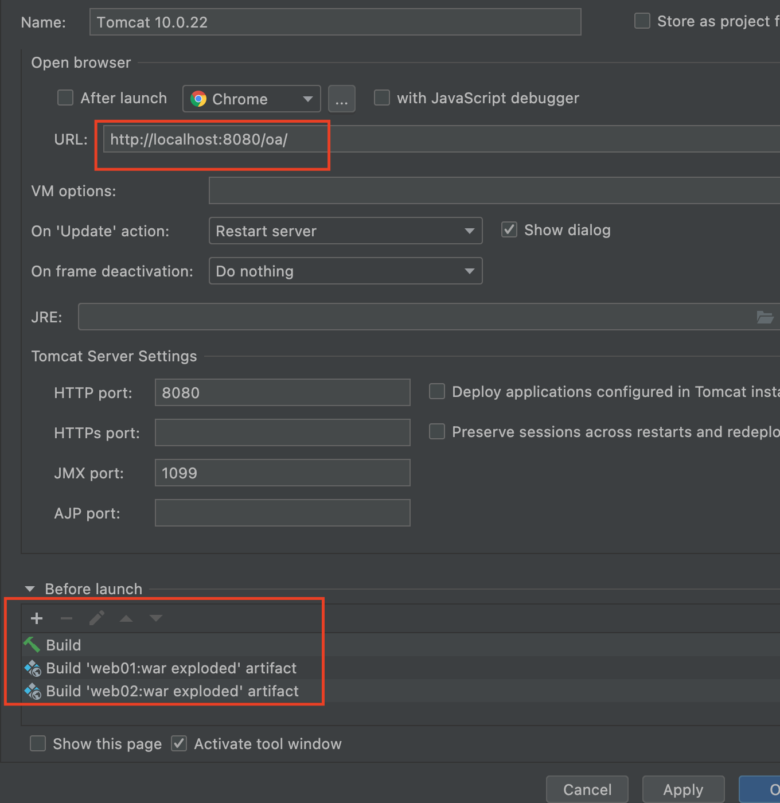

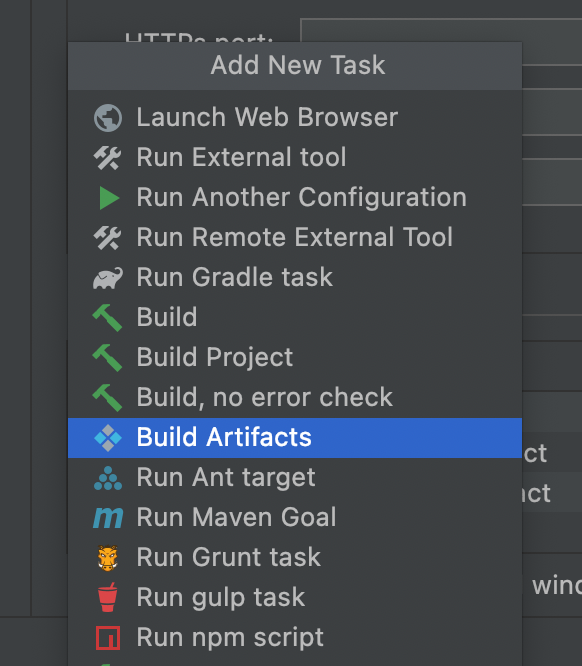

到此IDEA中的Tomcat服务器配置完成。

## 课设具体实现

### 知识回顾

#### 什么是E-R图 Entity Relationship Diagram

**三个核心概念**

画E-R图之前要了解的三个概念。

实体：具有相同性质并且可以相互区分的现实世界对象的集合，在E-R图中用矩形框表示，比如：学生、职工、课程等等


属性：实体所具有的某一特性称为属性，用椭圆表示，框内是属性名。例如，学生实体有学号、姓名、性别、出生年份、系、入学时间等属性，用E-R图表示实体-属性为：


联系：在现实世界中，事物内部及事物之间是有联系的，这些联系在信息世界中反应为实体（型）内部的联系和实体（型）之间的联系。在E-R图中用菱形框表示。

概念模型中的联系分为一对一联系、一对多联系和多对多联系三种类型，一对一联系是一对多联系的特例，一对多联系又是多对多联系的特例，如下表表示：

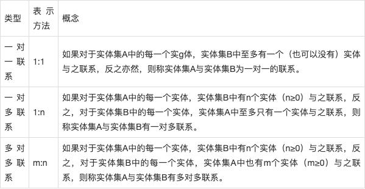

在一个物资管理系统中，涉及的实体有仓库、零件、供应桑、项目和职工，它们的属性如下表：

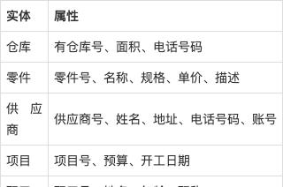

物资管理系统中实体之间的联系如下：

- 一个仓库可以存放多种零件，一种零件可以存放在多个仓库中，因此仓库和零件具有多对多的联系，用库存量来表示某种零件在某个仓库中的数量。
- 一个仓库有多个职工当仓库保管员，一个职工只能在一个仓库工作，因此仓库和职工之间是一对多的联系。
- 职工之间具有领导与被领导之间的管理，即仓库主任领导若干保管员，因此职工实体型中具有一对多的联系。
- 供应商、项目和零件两两之间具有多对多的联系。即一个供应商可以供给若干项目多种零件，每个项目可以使用不同供应商供应的零件，每种零件可以由不同供应商供给。

**E**-R图的创建

对该物资管理系统进行抽象建立概念模型E-R图的步骤如下：

1. 建立实体-属性图

   按照E-R图的表示，将上表的内容转换为如下的实体-属性图：

   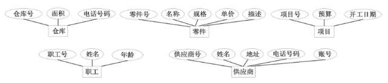

2. 按照E-R图形表示，可将物资管理系统实体间的联系转换为如下的实体-联系图。

   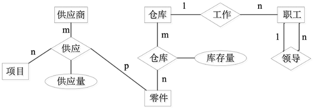

3. 建立完整的E-R图

   综合上面的实体-联系图和实体-属性图，可获得完整的E-R图，如下：

   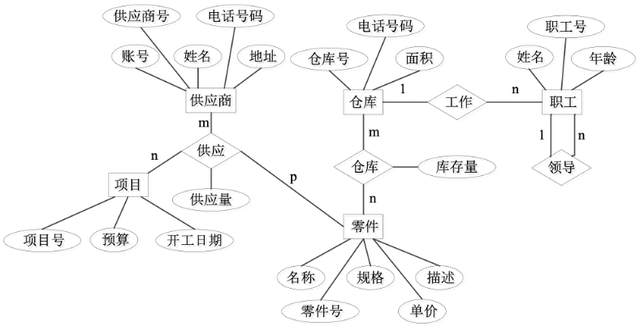

**什么是约束**

约束是在创建表的时候，可以给表的字段添加相应的约束，添加约束的目的是为了保证表中数据的合法性、有效性、完整性。

常见的约束有：非空约束 not null 、唯一约束 unique 、主键约束 primary key 、外键约束 foreign key 、检查约束 check 。

- 非空约束：约束的字段不能为NULL
- 唯一约束：约束的字段不能重复
- 主键约束：约束的字段既不能为NULL，也不能重复
- 外键约束：

**非空约束**

```sql
create table t_user(id int,user varchar(255) not null,password varchar(255));
insert into t_user(id,user,password) values (1,'123','111111');
```

**注意**：not null 只有列级约束，没有表级约束

**唯一约束**

唯一约束修饰的字段具有唯一性，不能重复，但可以为NULL

案例：给某一列添加 unique

```sql
drop table if exists t_user;

create table t_user(id int, username varchar(255) nuique);

insert into t_user values(1,'zhangsan');

#这一行报错会报错：Duplicate entry 'zhangsan' for key 'username'
insert into t_user values(2,'zhangsan');

```

案例：给两个列或者多个列添加 unique

```sql
#多个字段联合添加约束（表级约束）
create table t_user(id int,usercode varchar(255),username varchar(255),unique(usercode,username));
 
#以下三条语句执行不会出错
insert into t_user values(1,'111','zs');
insert into t_user values(2,'111','ls');
insert into t_user values(3,'222','ls');
```

```sql
#列级约束
create table t_user(id int,usercode varchar(255) unique,username varchar(255) unique);

insert into t_user values(1,'111','zs');

#这个语句会报错  Duplicate entry '111' for key 'usercode'
insert into t_user values(2,'111','ls')
```

**总结：**表级约束insert时只在unique的多个字段都一样的情况下才会触发；列级约束insert时只要和其中一个unique的字段一样，就会触发。

**主键约束**

给一张表添加主键约束：

```sql
drop table if exists t_user;

create table t_user(id int primary key,username varchar(255),email varchar(255));

insert into t_user(id,username,email) values(1,'zs','zs@123.com');

insert into t_user(id,username,email)values(2,'ls','ls@123.com');

insert into t_user(id,username,email)values(3,'ww','ww@123.com');

#这条语句报错 Duplicate entry '1' for key 'PRIMARY'
insert into t_user(id,username,email) values (1,'jack','jack@123.com');

#这条语句报错 Field 'id' doesn't have a default value
insert into t_user(username,email) values('jack','jack@123.com');
```

**小结：** id是主键，因为添加了主键约束，主键字段中的数据不能是NULL，也不能重复

主键相关术语：主键约束、主键字段、主键值

主键的作用：表的设计三泛式中有要求，第一范式就要求任何一张表都应该有主键，主键是这行记录在这张表中的唯一标识，<u>一张表的主键约束只能有一个</u>。

主键的分类：

- 根据主键的字段的字段数量来划分：单一主键和复合主键（多个字段联合起来添加一个主键约束，但是复合主键不适合使用，因为复合主键违背第三范式。）
- 根据主键的性质来划分：自然主键和业务主键（主键值和业务挂钩，例如：拿银行卡卡号作为，不推荐使用）最好不要拿着和业务挂钩的字段作为主键，因为以后的业务一旦发生改变的时候，主键的值也可能需要随着发生变化，担忧的时候没有办法变化，因为变化可能会导致主键值重复

使用表级约束方式定义主键：

```sql
drop table if exists t_user;

create table t_user(id int ,username varchar(255),primary key(id));

insert into t_user(id,username) values(1,'zs');
insert into t_user(id,username) values(2,'ls');
insert into t_user(id,username) values(3,'ww');
```

mysql提供主键值自增：

```sql
drop table if exists t_user;

create table t_user(id int primary key auto_increment,username varchar(255));

insert into t_user(username) values('zs');

insert into t_user(username) values('ls');

insert into t_user(username) values('ww');
```

**外键约束**

案例：

设计数据库表，用来维护学生和班级的信息。

第一种方案：一张表存储所有数据（有冗余）

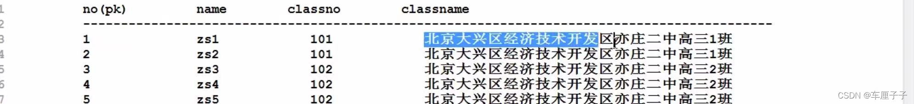

第二种方案：两张表（班级表和学生表）

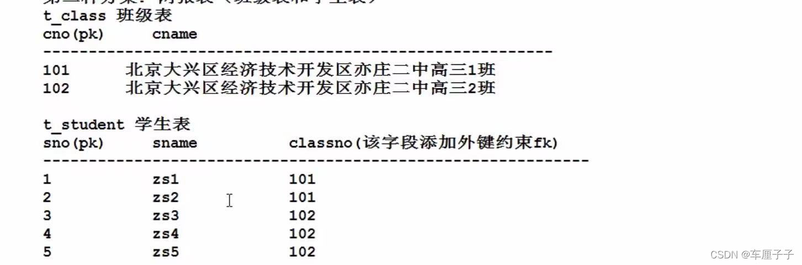

将以上表的建表语句写出来：

t_student中的classno字段引用t_class表中的cno字段，此时t_student表叫做子表，t_class表叫做父表。

删除数据的时候，先删除子表，再删除父表；

添加数据的时候，先添加父表，再添加子表；

创建表的时候，先创建父表，在创建子表；

删除表的时候，先删除子表，再删除父表。

```sql
drop table if exists t_student;
drop table if exists t_class;

create table t_class(cno int primary key,cname varchar(255));
create table t_student(sno int, sname varchar(255),classno int, foreign key(classno) references t_class(cno));

insert into t_class values(101,'class01'),(102,'class02');
insert into t_student values(1,'zs1',101),(2,'zs2',101),(3,'zs3',102),(4,'zs4',102),(5,'zs5',102),(6,'zs6',102);

#报错	 Cannot add or update a child row: a foreign key constraint fails (`Test`.`t_student`, CONSTRAINT `t_student_ibfk_1` FOREIGN KEY (`classno`) REFERENCES `t_class` (`cno`))
insert into t_student values(7,'zs7',103);
```

**注意：**被引用的字段不一定是主键，但至少具有unique约束

#### 什么是规则

- 库名与应用名称尽量一致

- 表名、字段名必须使用小写字母或数字，禁止出现数字开头

- 表名不使用复数名词

- 表的命名最好是加上“业务名称_表的作用”。如，edu_teacher

- ……

#### 什么是视图（数据库系统概论P119）

视图是从一个或几个基本表（或视图）中导出的表。它与基本表不同，是一个虚表。数据库中只存放视图的定义，而不存放视图对应的数据，这些数据仍存放在原来的基本表中。所以一旦基本表中的数据发生变化，从视图中查询出的数据也就随之改变了，从这个意义上讲，视图就像是一个窗口，透过它可以看到数据库中自己感兴趣的数据及其变化。

视图已经定义，就可以和基本表一样被查询、被删除。也可以在一个视图之上再定义新的视图，<u>但对视图的更新（增、删、改）操作则有一定的限制。</u>

**视图的存在意义：**关系型数据库中的数据是由一张一张的二维关系表所组成，简单的单表查询只需要遍历一个表，而复杂的多表查询需要将多个表连接起来进行查询任务。对于复杂的查询事件，每次查询都需要编写MySQL代码效率低下。

视图的其他解释：

数据库中的视图是一个虚拟表，同真实的表一样，视图包含一系列带有名称的行和列数据，行和列数据来自定义视图查询所引用的表，并且在引用视图时动态生成。视图是从一个或者多个表中导出的，视图的行为与表非常相似，但视图是一个虚拟表。在视图中用户可以使用SELECT语句查询数据，以及使用INSERT、UPDATE和DELETE修改记录。视图可以使用户操作方便，而且可以保障数据库系统的安全。当对通过视图看到的数据进行修改时，相应的基本表的数据也要发生变化。同时，若基本表的数据发生变化，则这种变化也可以自动地反映到视图中。

视图是一个”虚表”，用大白话说，就是从已经存在的表的全部字段或数据中，挑选出来一部分字段或数据，组成另一张”并不存在的表”,这张虚表被称之”视图”。视图中的字段与对应的数据均来自已经存在的表。对于视图来说，这些已经存在的表就被称为”基表”。基表可以是一张表，也可以是多张表。视图的本质可以理解为一条查询语句，视图中显示的结果，就是这条查询语句查询出的结果。

**创建视图**

1. 首先确保当前登陆数据库用户是否有创建视图的权限

   ```sql
   select User,create_view_priv,select_priv from mysql.user;
   ```

2. 创建或者修改视图

   ```sql
   CREATE [OR REPLACE] [{FORCE|NOFORCE}] VIEW view_name
    
   AS
    
   SELECT查询
    
   [WITH READ ONLY CONSTRAINT]
   ```

3. 语法解析

   - OR REPLACE：如果视图已经存在，则替换旧视图。

   - FORCE：即使基表不存在，也可以创建该视图，但是该视图不能正常使用，当基表创建成功后，视图才能正常使用。

   - NOFORCE：如果基表不存在，无法创建视图，该项是默认选项。

   - WITH READ ONLY：默认可以通过视图对基表执行增删改操作，但是有很多在基表上的限制(比如：基表中某列不能为空，但是该列没有出现在视图中，则不能通过视图执行insert操作)，WITH READ ONLY说明视图是只读视图，不能通过该视图进行增删改操作。现实开发中，基本上不通过视图对表中的数据进行增删改操作。

示例：

```sql
#将学生表中性别为男的学生生成一个视图

create view view_test1
AS
select * from students where stu_gender = '男';

#执行语句：
select * from view_test1;
```

**修改视图**

```sql
#方式一：这个视图没有就创建，有就修改
create or replace view 视图名
AS
查询语句;

#方式二：
alter view 视图名
查询语句;
```

**删除视图**

```sql
#可以连续删除多个视图
DROP VIEW 视图1，视图2,……;
```

**查看视图**

```sql
#查看视图结构 field 字段
DESC 视图名；
#查看创建视图的逻辑
show create view 视图名;
```

**视图更新**

为了防止用户通过视图对数据进行增加、删除、修改时，有意无意地对不属于视图范围内的基本表数据进行操作，可在定义视图时加上WITH CHECK OPTION子句，这样在视图上增、删、改数据时，关系数据库管理系统会检查视图定义中的条件，若不满足条件则拒绝执行该操作。

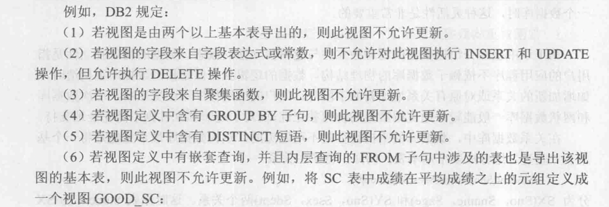

#### 什么是存储过程

存储过程是一些sql语句和控制语句组成的被封装起来的过程，它驻留在数据库中可以被客户应用程序通过存储过程名字调用，也可以从另一个存储过程或者触发器调用。

它的参数可以被传递和返回，与应用程序中的**函数**过程类似，存储过程可以通过名字来调用，具有输入参数和输出参数，创建存储过程就像是定义了一个函数。

**使用场景**

存储过程适用于处理场景固定的复杂事务，不要求并发性。互联网高并发的场景，很多数据都是分库分表的，而且要求高度可扩展，原则是对db的保护做到最大化，能减少db压力的就减少db压力，尽量把运算逻辑拉到代码里面。存储过程的优点在于封装性好，直接让db进行运算，但是缺点在于难以维护（修改业务逻辑需要DBA进行操作，而不是后端程序员修改代码），而且大大增大db压力。

1. 创建存储过程

   ```sql
   CREATE OR REPLACE PROCEDURE 过程名([参数1,参数2，……])
   AS<过程化SQL块>;
   ```

2. 执行存储过程

   ```sql
   CALL/PERFORM PROCEDURE 过程名([参数1,参数2,……]);
   ```

3. 修改存储过程

   ```sql
   #重命名一个存储过程
   ALTER PROCEDURE 过程名1 RENAME TO 过程名2;
   
   #重新编译一个存储过程
   ALTER PROCEDURE 过程名 COMPILE;
   ```

4. 删除存储过程

   ```sql
   DROP PROCEDURE 过程名();
   ```

#### 什么是触发器

触发器是用户定义在关系表上一类由事件驱动的特殊过程，一旦定义，触发器将被保存在数据库服务器中，任何用户对表的增删改操作均由服务器自动激活相应的触发器，在关系数据库管理系统核心层进行集中的完整性控制，触发器类似于约束，但是比约束更加灵活，可以实施更为复杂的检查和操作，具有更精细和更强大的数据控制能力。

1. 定义触发器

   触发器又叫做事件-条件-动作规则，一般格式为

   ```sql
   create trigger <触发器名>
   {before | after}<触发事件> on <表名>
   
   referencing new|old row as <变量>
   
   for each {row | statement}
   [when<触发条件>]<触发动作体>
   ```

2. 删除触发器

   ```sql
   DROP TRIGGER <触发器名> on <表名>
   ```

   

#### 什么是范式

1. 第一范式（1NF）：

所谓第一范式（1NF）是指在关系模型中，对于添加的一个规范要求，所有的域都应该是原子性的，即数据库表的每一列都是不可分割的原子数据项，而不能是集合，数组，记录等非原子数据项。即实体中的某个属性有多个值时，必须拆分为不同的属性。在符合第一范式（1NF）表中的每个域值只能是实体的一个属性或一个属性的一部分。简而言之，第一范式就是无重复的域。

说明：在任何一个关系数据库中，第一范式（1NF）是对关系模式的设计基本要求，一般设计中都必须满足第一范式（1NF）。不过有些关系模型中突破了1NF的限制，这种称为非1NF的关系模型。换句话说，是否必须满足1NF的最低要求，主要依赖于所使用的关系模型。

2. 第二范式（2NF）

在1NF的基础上，非码属性必须完全依赖于候选码（在1NF基础上消除非主属性对主码的部分函数依赖）

第二范式（2NF）是在第一范式（1NF）的基础上建立起来的，即满足第二范式（2NF）必须先满足第一范式（1NF）。第二范式（2NF）要求数据库表中的每个实例或记录必须可以被唯一地区分。选取一个能区分每个实体的属性或属性组，作为实体的唯一标识。例如在员工表中的身份证号码即可实现每个一员工的区分，该身份证号码即为候选键，任何一个候选键都可以被选作主键。在找不到候选键时，可额外增加属性以实现区分，如果在员工关系中，没有对其身份证号进行存储，而姓名可能会在数据库运行的某个时间重复，无法区分出实体时，设计辟如ID等不重复的编号以实现区分，被添加的编号或ID选作主键。（该主键的添加是在ER设计时添加，不是建库时随意添加）

第二范式（2NF）要求实体的属性完全依赖于主关键字。所谓完全依赖是指不能存在仅依赖主关键字一部分的属性，如果存在，那么这个属性和主关键字的这一部分应该分离出来形成一个新的实体，新实体与原实体之间是一对多的关系。为实现区分通常需要为表加上一个列，以存储各个实例的唯一标识。简而言之，第二范式就是在第一范式的基础上属性完全依赖于主键。

3. 第三范式（3NF）

在2NF基础上，任何非主属性不依赖于其它非主属性（在2NF基础上消除传递依赖）

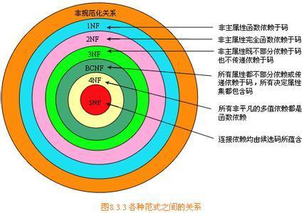

第三范式（3NF）是第二范式（2NF）的一个子集，即满足第三范式（3NF）必须满足第二范式（2NF）。简而言之，第三范式（3NF）要求一个关系中不包含已在其它关系已包含的非主关键字信息。例如，存在一个部门信息表，其中每个部门有部门编号（dept_id）、部门名称、部门简介等信息。那么在员工信息表中列出部门编号后就不能再将部门名称、部门简介等与部门有关的信息再加入员工信息表中。如果不存在部门信息表，则根据第三范式（3NF)也应该构建它，否则就会有大量的数据冗余。简而言之，第三范式就是属性不依赖于其它非主属性，也就是在满足2NF的基础上，任何非主属性不得传递依赖于主属性。

#### ~~数据库用户权限~~

### E-R图、建表

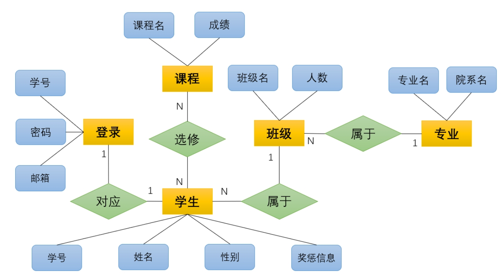

根据上面的语义，设计的符合3NF的数据库表信息,以及对应的建表语句如下

(下划线为主键，加粗为外键)：   


<style type="text/css">
.tg  {border-collapse:collapse;border-spacing:0;}
.tg td{border-color:black;border-style:solid;border-width:1px;font-family:Arial, sans-serif;font-size:14px;
  overflow:hidden;padding:10px 5px;word-break:normal;}
.tg th{border-color:black;border-style:solid;border-width:1px;font-family:Arial, sans-serif;font-size:14px;
  font-weight:normal;overflow:hidden;padding:10px 5px;word-break:normal;}
.tg .tg-c3ow{border-color:inherit;text-align:center;vertical-align:top}
.tg .tg-9353{border-color:inherit;font-weight:bold;text-align:center;text-decoration:underline;vertical-align:top}
.tg .tg-zw5y{border-color:inherit;text-align:center;text-decoration:underline;vertical-align:top}
</style>
<table class="tg">
<thead>
  <tr>
    <th class="tg-c3ow" colspan="5">学生信息表 StudentTable</th>
  </tr>
</thead>
<tbody>
  <tr>
    <td class="tg-9353">学号</td>
    <td class="tg-c3ow">姓名</td>
    <td class="tg-c3ow">性别</td>
    <td class="tg-zw5y"><span style="font-weight:bold">班级号</span></td>
    <td class="tg-c3ow">奖惩信息</td>
  </tr>
  <tr>
    <td class="tg-9353">sid</td>
    <td class="tg-c3ow">name</td>
    <td class="tg-c3ow">sex</td>
    <td class="tg-zw5y"><span style="font-weight:bold">classid</span></td>
    <td class="tg-c3ow">sinfo</td>
  </tr>
  <tr>
    <td class="tg-9353">varchar(10)<br>只能是10位数字</td>
    <td class="tg-c3ow">varcahr(20)</td>
    <td class="tg-c3ow">varcahr(10)，在前端设置下拉框<br>限制只能输入'男'或'女'</td>
    <td class="tg-zw5y"><span style="font-weight:bold">int</span></td>
    <td class="tg-c3ow">archer，记录奖惩<br>信息，可空</td>
  </tr>
</tbody>
</table>
<style type="text/css">
.tg  {border-collapse:collapse;border-spacing:0;}
.tg td{border-color:black;border-style:solid;border-width:1px;font-family:Arial, sans-serif;font-size:14px;
  overflow:hidden;padding:10px 5px;word-break:normal;}
.tg th{border-color:black;border-style:solid;border-width:1px;font-family:Arial, sans-serif;font-size:14px;
  font-weight:normal;overflow:hidden;padding:10px 5px;word-break:normal;}
.tg .tg-baqh{text-align:center;vertical-align:top}
.tg .tg-t2cw{font-weight:bold;text-align:center;text-decoration:underline;vertical-align:top}
</style>
<table class="tg">
<thead>
  <tr>
    <th class="tg-baqh" colspan="3">登录信息表 LoginTable</th>
  </tr>
</thead>
<tbody>
  <tr>
    <td class="tg-t2cw">学号</td>
    <td class="tg-baqh">密码</td>
    <td class="tg-baqh">邮箱</td>
  </tr>
  <tr>
    <td class="tg-t2cw">sid</td>
    <td class="tg-baqh">password</td>
    <td class="tg-baqh">mail</td>
  </tr>
  <tr>
    <td class="tg-t2cw">archer(10)<br>只能是10位数字</td>
    <td class="tg-baqh">varchar</td>
    <td class="tg-baqh">varchar用于找回密码</td>
  </tr>
</tbody>
</table>

<style type="text/css">
.tg  {border-collapse:collapse;border-spacing:0;}
.tg td{border-color:black;border-style:solid;border-width:1px;font-family:Arial, sans-serif;font-size:14px;
  overflow:hidden;padding:10px 5px;word-break:normal;}
.tg th{border-color:black;border-style:solid;border-width:1px;font-family:Arial, sans-serif;font-size:14px;
  font-weight:normal;overflow:hidden;padding:10px 5px;word-break:normal;}
.tg .tg-baqh{text-align:center;vertical-align:top}
.tg .tg-t2cw{font-weight:bold;text-align:center;text-decoration:underline;vertical-align:top}
</style>
<table class="tg">
<thead>
  <tr>
    <th class="tg-baqh" colspan="3">成绩信息表 ScoreTable</th>
  </tr>
</thead>
<tbody>
  <tr>
    <td class="tg-t2cw">课程号</td>
    <td class="tg-t2cw">学号</td>
    <td class="tg-baqh">成绩</td>
  </tr>
  <tr>
    <td class="tg-t2cw">courseid</td>
    <td class="tg-t2cw">sid</td>
    <td class="tg-baqh">score</td>
  </tr>
  <tr>
    <td class="tg-t2cw">int</td>
    <td class="tg-t2cw">varchar(10)<br>只能是10位数字</td>
    <td class="tg-baqh">int</td>
  </tr>
</tbody>
</table>

<style type="text/css">
.tg  {border-collapse:collapse;border-spacing:0;}
.tg td{border-color:black;border-style:solid;border-width:1px;font-family:Arial, sans-serif;font-size:14px;
  overflow:hidden;padding:10px 5px;word-break:normal;}
.tg th{border-color:black;border-style:solid;border-width:1px;font-family:Arial, sans-serif;font-size:14px;
  font-weight:normal;overflow:hidden;padding:10px 5px;word-break:normal;}
.tg .tg-baqh{text-align:center;vertical-align:top}
.tg .tg-t2cw{font-weight:bold;text-align:center;text-decoration:underline;vertical-align:top}
</style>
<table class="tg">
<thead>
  <tr>
    <th class="tg-baqh" colspan="2">课程信息表 CourseTable</th>
  </tr>
</thead>
<tbody>
  <tr>
    <td class="tg-baqh">课程号</td>
    <td class="tg-baqh">课程名</td>
  </tr>
  <tr>
    <td class="tg-t2cw">courseid</td>
    <td class="tg-baqh">coursename</td>
  </tr>
  <tr>
    <td class="tg-t2cw">int自增</td>
    <td class="tg-baqh">varchar</td>
  </tr>
</tbody>
</table>

<style type="text/css">
.tg  {border-collapse:collapse;border-spacing:0;}
.tg td{border-color:black;border-style:solid;border-width:1px;font-family:Arial, sans-serif;font-size:14px;
  overflow:hidden;padding:10px 5px;word-break:normal;}
.tg th{border-color:black;border-style:solid;border-width:1px;font-family:Arial, sans-serif;font-size:14px;
  font-weight:normal;overflow:hidden;padding:10px 5px;word-break:normal;}
.tg .tg-baqh{text-align:center;vertical-align:top}
.tg .tg-t2cw{font-weight:bold;text-align:center;text-decoration:underline;vertical-align:top}
.tg .tg-amwm{font-weight:bold;text-align:center;vertical-align:top}
</style>
<table class="tg">
<thead>
  <tr>
    <th class="tg-baqh" colspan="4">班级人数信息表 ClassTabe</th>
  </tr>
</thead>
<tbody>
  <tr>
    <td class="tg-t2cw">班级号</td>
    <td class="tg-baqh">班级名</td>
    <td class="tg-amwm">专业名</td>
    <td class="tg-baqh">人数</td>
  </tr>
  <tr>
    <td class="tg-t2cw">classid</td>
    <td class="tg-baqh">classname</td>
    <td class="tg-amwm">major</td>
    <td class="tg-baqh">num</td>
  </tr>
  <tr>
    <td class="tg-t2cw">int 自增</td>
    <td class="tg-baqh">varcher(10)</td>
    <td class="tg-amwm">archer(50)</td>
    <td class="tg-baqh">int</td>
  </tr>
</tbody>
</table>

<style type="text/css">
.tg  {border-collapse:collapse;border-spacing:0;}
.tg td{border-color:black;border-style:solid;border-width:1px;font-family:Arial, sans-serif;font-size:14px;
  overflow:hidden;padding:10px 5px;word-break:normal;}
.tg th{border-color:black;border-style:solid;border-width:1px;font-family:Arial, sans-serif;font-size:14px;
  font-weight:normal;overflow:hidden;padding:10px 5px;word-break:normal;}
.tg .tg-baqh{text-align:center;vertical-align:top}
.tg .tg-t2cw{font-weight:bold;text-align:center;text-decoration:underline;vertical-align:top}
</style>
<table class="tg">
<thead>
  <tr>
    <th class="tg-baqh" colspan="2">院系信息表 FacultyTable</th>
  </tr>
</thead>
<tbody>
  <tr>
    <td class="tg-t2cw">专业名</td>
    <td class="tg-baqh">院系</td>
  </tr>
  <tr>
    <td class="tg-t2cw">major</td>
    <td class="tg-baqh">faculty</td>
  </tr>
  <tr>
    <td class="tg-t2cw">varchar(50)</td>
    <td class="tg-baqh">varchar(50)</td>
  </tr>
</tbody>
</table>
### ~~数据库语句~~

### ~~功能测试~~

### 数据库的备份与恢复

#### 数据库的备份

修改配置文件my.cnf：为了在使用mysqldump命令时能省略输入密码执行 mysqldump --all-databases > /backups/data.sql

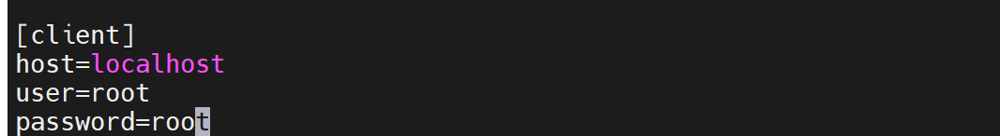

1. 编写数据库备份脚本dbbackup.sh

```shell
#!/bin/bash# 文件名
dd=`date +"%Y%m%d%H%M%S"`
# 保存备份个数
number=15
# 备份保存路径
backup_dir=/var/lib/mysql/backups
# 将要备份的数据库
database_name=webpro
# 如果文件夹不存在则创建
if [ ! -d $backup_dir ];
then
mkdir -p $backup_dir;
fi
# 执行备份命令
mysqldump --defaults-extra-file=/etc/my.cnf $database_name > $backup_dir/$database_name-$dd.sql
# 写创建备份日志
echo "create $backup_dir/$database_name-$dd.dupm" >> $backup_dir/log.txt
# 找出需要删除的备份
delfile=`find $backup_dir -name "*.sql" | head -1`
# 判断现在的备份数量是否大于$number
count=`find $backup_dir -name "*.sql" | wc -l`
if [ $count -gt $number ]
then
# 删除最早生成的备份，只保留number数量的备份
rm $delfile
# 写删除文件日志
echo "delete $delfile" >> $backup_dir/log.txt
fi
```

2. 使用CentOS下的crond进程自动执行该脚本

   ```shell
   vim /etc/crontab
   ```

   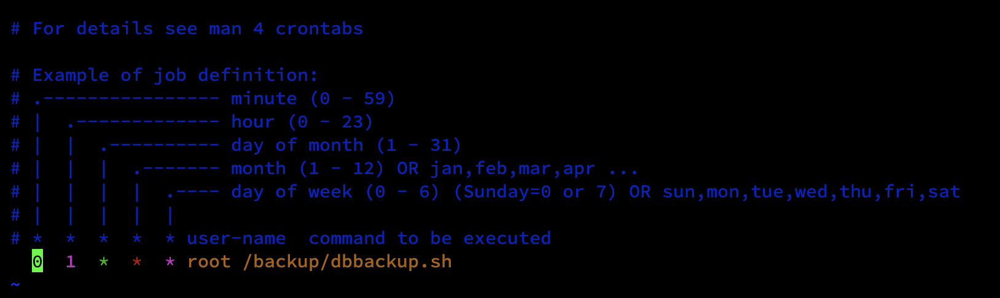

   如上图的设置，在每天01:00时刻执行数据库的备份操作，重启crond进程使修改的设置生效。

   ```shell
   service crond restart
   ```

   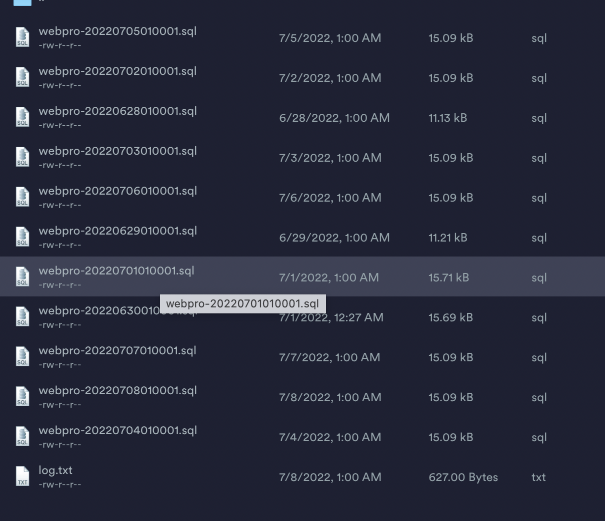

   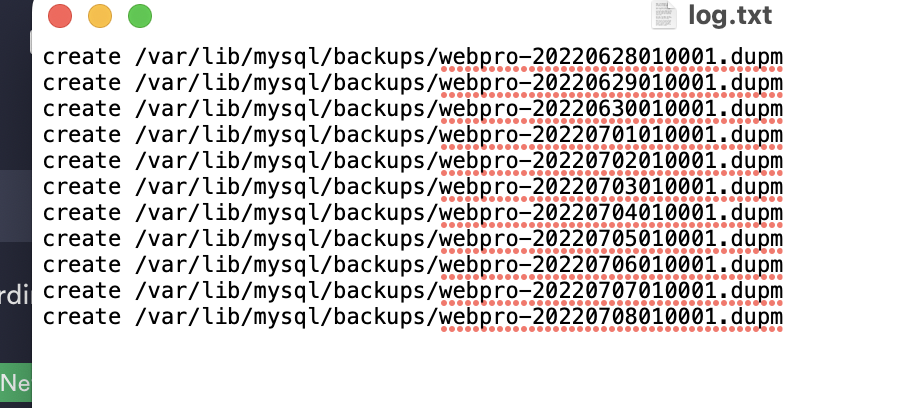

​		定时生成的数据库备份和日志文件内容如上。

#### 数据库的恢复

开启数据库的二进制日志文件功能

```sql
SHOW VARIABLES LIKE 'log_bin';
```

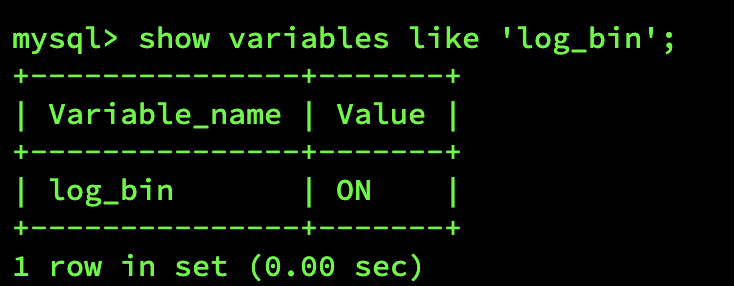

如果没有开启的话就在配置文件中添加 log-bin 选项来开启二进制日志

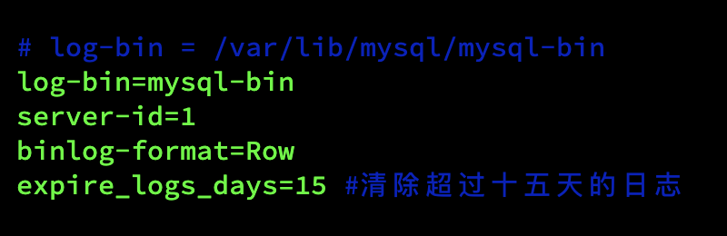

前端编写backup.html界面

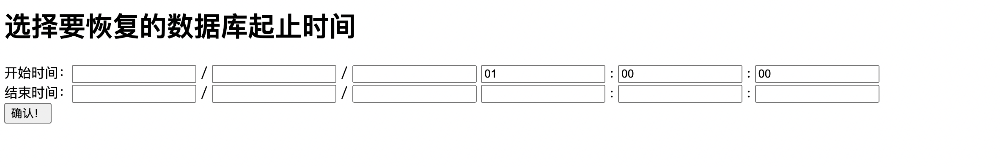

提交之后执行如下函数

```java
//将从backup.html获得的时间进行拼接
String start_date = yy1+mm1+dd1+"010000";
String end_date = yy2+'-'+mm2+'-'+dd2+' '+hh+':'+ff+':'+ss;

//通过exec函数可以实现java调用linux的shell

//先执行数据库的恢复
//mysql --defaults-extra-file=/etc/my.cnf webpro < /var/lib/mysql/backups/"+start_date+".sql

//再根据日志文件恢复到指定的时间点
//mysqlbinlog --stop-datetime='"+ end_date +"' /var/lib/mysql/mysql-bin.000004 | mysql --defaults-extra-file=/etc/my.cnf
String start = exec("mysql --defaults-extra-file=/etc/my.cnf webpro < /var/lib/mysql/backups/"+start_date+".sql").toString();
String stop = exec("mysqlbinlog --stop-datetime='"+ end_date +"' /var/lib/mysql/mysql-bin.000004 | mysql --defaults-extra-file=/etc/my.cnf").toString();
```

```java
//exec函数的具体实现如下：
public class ExecLinuxCMD {

    public static Object exec(String cmd) {
        try {
            String[] cmdA = { "/bin/sh", "-c", cmd };
            Process process = Runtime.getRuntime().exec(cmdA);
            LineNumberReader br = new LineNumberReader(new InputStreamReader(
                    process.getInputStream()));
            StringBuffer sb = new StringBuffer();
            String line;
            while ((line = br.readLine()) != null) {
                System.out.println(line);
                sb.append(line).append("\n");
            }
            return sb.toString();
        } catch (Exception e) {
            e.printStackTrace();
        }
        return null;
    }
}
```

# 总结

这次数据库课设前前后后查了不少的资料，尽管我的工作大部分是前端或者是操作系统方面的内容，和数据库这门课程没有太大的关系，但也学到了不少的新知识，比较可惜的是我们在最初的需求分析阶段疏忽大意了，做出的产品并不能满足用户的需求。

附上一个网上跟我们同样题目并且需求分析做的不错的[帖子](https://blog.csdn.net/qq_52030824/article/details/122080689)。

我会利用暑假时间学习一下git的使用，把这次课设的代码push到github上面。
