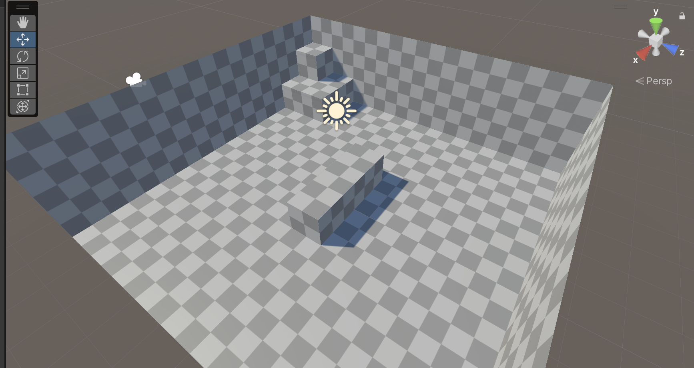
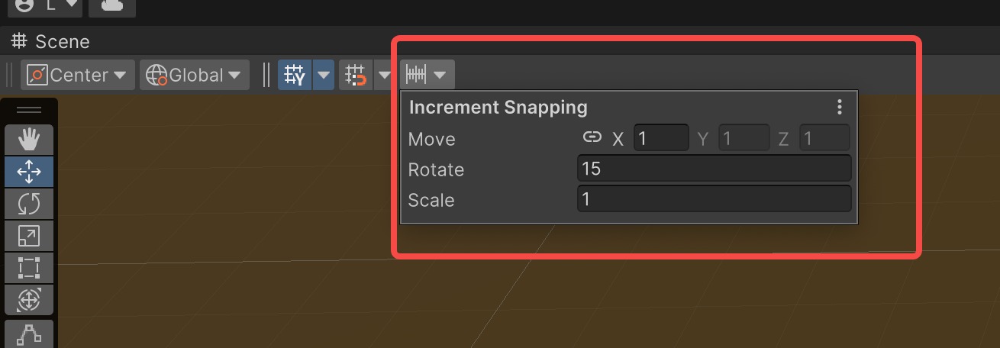

# 场景搭建

在开始进入正题之前，需要先搭建一个可以供角色站立、移动、跳跃并且还有边界的测试场景。笔者希望搭建的场景要遵循一些规范：
1. 统一所有模型资源的单位长度，极特殊情况，所有模型的缩放都设置为1
2. 将场景中的地形预制体化，比如墙、地面、台阶等
3. ...

下面说一个可以提高我们搭建场景效率的工具：在Unity的Scene窗口中，点击下图位置的图标可以设置物体移动的固定步长。[参考文章在这](https://jingyan.baidu.com/article/1612d500968440e20e1eeebd.html)，按住`Control/Command`键拖拽Scene中选中物体的Object坐标系的坐标轴，就可以以固定的步长移动物体了。按住`V`键拖拽坐标轴就可以让选中物体的选中顶点吸附到另一个场景中的物体上。

## 创建地形

Unity中自带的用来表示平面的物体是`Plane`模型，用来表示墙面的物体是`Quad`模型，在场景中创建Plane模型，查看这个模型的详细信息，你会发现这个模型的尺寸是10x10的(此处不考虑模型的厚度)，也就是长宽各为10个单位长度；而Quad模型则是1x1的，长宽个1个单位长度。为了让地形看起来不那么单调，我们使用Unity内置的一张贴图来装饰我们的地形，我们会为Plane和Quad各自生成一个材质，这两个材质的区别只有上面的Tilling参数，一个设置成10，而另一个设置为1。这样的设置主要和这两种模型的尺寸有关系。然后将材质分别赋给这两个模型。好了，这样我们就有搭建场景的预制地形了。

- 讲清楚 模型的面片和材质上Tilling的对应关系 注意场景搭建的规范 所有的模型都适用1:1的大小标准

