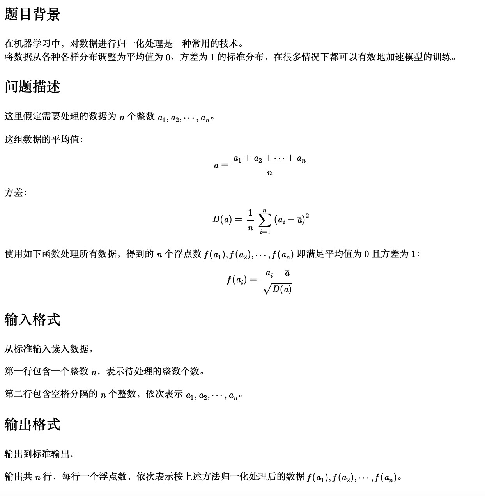

<!--more-->


# 一、归一化处理



 [原题链接](http://118.190.20.162/view.page?gpid=T148)


## 代码

```cpp
#include<iostream>
#include<cmath>
using namespace std;
//开方函数 sqrt
//平方函数 pow
//绝对值函数 fabs
int main(){

    int n;

    cin >> n;

    double avg = 0;
    double Da = 0;
    double num[n];
    double fa;
    for(int i = 0; i < n; i++){

        cin >> num[i];
        avg += num[i];

    }

    avg = avg / n;

    for(int i = 0; i < n; i++){

        Da += pow((num[i] - avg), 2);
    }

  
  	//控制输出至小数点后10位
    cout << fixed << setprecision(10);
    for(int i = 0; i < n; i++){

        fa = (num[i] - avg) / sqrt(Da);
        //printf("%f \n",fa);
        cout << fa << endl;
    }

    return 0;


}
```

使用文件重定向

```sh
./aout < in.txt > out.txt
```

