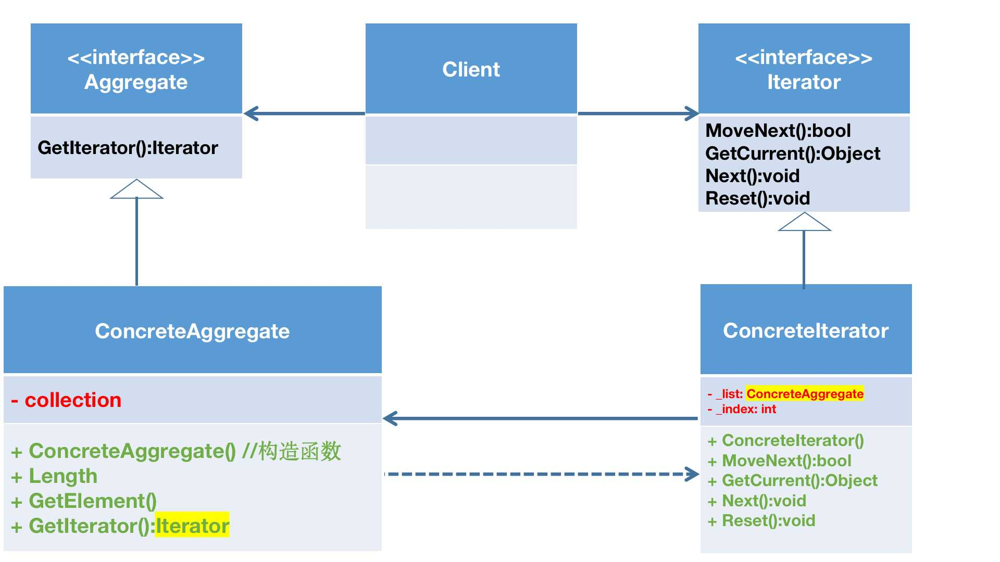

# 单例模式

单例模式的官方定义是：确保一个类只有一个实例，并提供一个全局的访问点。

这里涉及到一个类的实例创建时机的问题。

在之前的学习中其实一直没有太理解static的含义，这与我不太理解一个program和运行起来的有很大的关系，我一直以为Main函数是最开始的入口，

## C#中static关键字的解释

### 静态类

1. 只能包含静态成员（静态方法或者静态变量），非静态成员是不能使用的，而非静态类可以包含静态的方法、字段、属性或者事件，并且无论对这个非静态类创建多少个实例，它的静态成员都只有一个。
2. 不能对其实例化。
3. 不能被继承，因为静态类本质上是一个抽象密封类。
4. 不能包含实例构造函数。
5. 静态类本质上是一群方法的集合。

### 静态变量

1. static只能修饰成员变量，不能修饰局部变量。
2. 表示每次重新使用该变量所在的方法、类或者自定义类时，变量的值为程序这次运行最后一次为变量赋值时的值。
3. 静态变量一直记录变量的值，一直到下次赋值的时候。
4. 不同线程下访问的静态属性总是同一属性，如果某一线程更改了属性值，将造成其他线程访问属性值的错误。因此方法中访问同一静态属性就要使用`lock`关键字，或者创建互斥对象来保持静态属性在同一时间只能被某一对象的属性或方法访问。
5. 静态成员只被创建一次，所以静态成员只有一份，而实例成员有多少个对象，就有多少个成员。

### 静态方法

1. 在方法前使用static修饰，表示此方法为所在类或所在自定义所有，而不是这个类的实例所有。
2. 在静态方法中只能直接调用同类中其他的静态成员（包括变量和方法），而不能直接访问类中的非静态成员。
3. 每一个线程在同一时间访问的静态方法都是不同的，因此静态方法在多线程调用中不会产生冲突。
4. 在静态方法中不能直接调用实例成员，因为静态方法被调用的时候，对象还有可能不存在，
5. this/base关键字在静态方法中不能使用，因为有可能对象还不存在。
6. 静态方法只能被重载，不能被重写，因为静态方法不属于类的实例成员

### 静态构造函数

1. 静态类可以有静态构造函数，静态构造函数不可以被继承。
2. 静态构造函数用于初始化任何静态的数据，或执行仅需执行一次的特定操作，将在创建第一个实例或者引用任何静态成员之前自动调用静态构造函数。
3. 可以用于静态类，也可以用于非静态类。
4. 无访问修饰符、无参数，zhiyouyigestatic标志。
5. 不可以直接被调用，当创建类实例或引用任何静态成员之前，静态构造函数被自动执行，并且只执行一次。

什么时候适合用static？

1. 当变量需要被共享时可以将变量定义为静态变量。
2. 当方法需要被反复调用时可以将方法定义为静态方法。
3. 当一个类中包含的成员都是静态时可以将类定义为静态类。

**补充：**静态成员和静态方法是一样的，它们不属于某一个实例化的对象，而是属于这个类本身的。如果实例化的类想要调用或者访问类中的静态成员或方法可以声明一个非静态的方法，并在该方法中调用静态方法或者返回静态成员，来实现实例化的对象对静态成员和静态方法的调用。

**疑问：**为什么静态成员和方法不能使用`.`运算符访问到呢？

**答：**静态方法和静态数据成员一样，是类的一部分，不是对象的一部分，静态成员和方法对实例化的对象是没有任何意义的，因为静态方法中不能调用非静态的成员，也就影响不到实例化对象的成员和方法，感觉还是说的不太明白，慢慢理解吧。

~~**挖坑：静态成员、方法、类被创建出来的时机。**~~已填坑

说到单例模式，单例模式中又有懒汉模式和饿汉模式

- 懒汉模式：一开始不会实例化，什么时候用就什么时候new
- 饿汉模式：一开始类加载的时候就已经实例化，并创建单例对象，以后只管用

懒汉代码实现：

```C#
public class Singleton{
	private static Singleton instance = null;
	private Singleton(){
	
	}
	public static synchronized Singleton getInstance(){
		if(instance == null){
			instance = new Singleton();
		}
		return instance;
	}
}
```

饿汉代码实现：

```C#
public class Singleton{
	private static Singleton instance = new singleton();
	private Singleton(){
	
	}
	public static Singleton getInstance(){
		return instance;
	}
}
```

饿汉与懒汉的安全和性能区别：

1. 线程安全，饿汉在线程还没出现之前就已经实例化了，所以饿汉一定是线程安全的，懒汉是在使用时才回去new实例的，new是一个动态的过程，是放到方法中实现的。如果这个时候有多个线程访问这个实例，这个时候实例还不存在，还在new，就会进入到方法中，有多少线程就会new出多少实例。一个方法只能return一个实例，那最终return出哪个呢？
1. 执行效率：饿汉模式没有加任何的锁，因此执行效率比较高。懒汉式一般使用都会加同步锁，效率比饿汉式差。
1. 内存使用：饿汉在一开始类加载的时候就实例化，无论使用与否，都会实例化，所以会占据内存空间，浪费内存。懒汉式什么时候用才什么时候实例化，不浪费内存。

# 迭代器模式

迭代器模式是针对集合对象而生的，对于集合对象而言，必然涉及到集合元素的添加删除操作，同时也肯定支持遍历集合元素的操作，我们此时可以吧遍历操作也放在集合对象中，但是这样的话，集合对象就承担了太多责任了，面向对象设计原则中有一条是单一职责原则，所以我们要尽可能的去分离这些指责，使用不同的类去承担不同的职责。迭代器模式就是用迭代器类来承担遍历集合元素的职责。

## 迭代器模式的定义

迭代器模式提供了一种方法顺序访问一个聚合对象（理解为集合对象）中的各个元素，而又无需暴露该对象的内部表示，这样既可以做到不暴露集合的内部结构，又可以让外部的代码透明地访问集合内部的数据。

## 迭代器模式的结构

既然迭代器模式承担了遍历集合对象的职责，则该模式自然存在两个类，一个是聚合类，一个是迭代器类。在面向对象设计的原则中还有一条是面向接口编程，所以在迭代器模式中，抽象了两个接口，一个是聚合接口，一个是迭代器接口，这样迭代器模式中就有四个角色了，具体的类图如下：（UML图的相关介绍在[这篇文章](http://soincredible777.com.cn/posts/6ea8fdb7/)）



从上图可以看出，迭代器模式由以下角色组成：

- 迭代器角色`Iterator`：迭代器角色负责定义
- 具体迭代器角色`Concrete Iterator`：具体迭代器角色实现了迭代器接口，并记录遍历中的当前位置
- 聚合角色`Aggregate`：聚合角色负责定义获得迭代器角色的接口
- 具体聚合角色`Concrete Aggregate`：具体聚合角色实现聚合角色接口

## 迭代器模式的实现

```C#
// 抽象聚合类

public interface IListCollection
{
    Iterator GetIterator();
}

public interface IIterator
{
    bool MoveNext();
    Object GetCurrent();
    void Next();
    void Reset();
}


public class ConcreteList : IListCollection
{
    private int[] collection;

    public ConcreteList()
    {
        collection = new int[] { 2, 4, 6, 8 };
    }

    public Iterator GetIterator()
    {
        return new ConcreteIterator(this);
    }

    public int Length
    {
        get { return collection.Length; }
    }

    public int GetElement(int index)
    {
        return collection[index];
    }
}


public class ConcreteIterator : IIterator
{
    private ConcreteList _list;
    private int _index;

    public ConcreteIterator(ConcreteList list)
    {
        _list = list;
        _index = 0;
    }

    public bool MoveNext()
    {
        if (_index < _list.Length)
        {
            return true;
        }

        return false;
    }

    public Object GetCurrent()
    {
        return _list.GetElement(_index);
    }

    public void Reset()
    {
        _index = 0;
    }

    public void Next()
    {
        if (_index < _list.Length)
        {
            _index++;
        }
    }
}


// 客户端
class Program
{
    static void Main(string[] args)
    {
        Iterator iterator;
        IListCollection list = new ConcreteList();
        iterator = list.GetIterator();

        while (iterator.MoveNext())
        {
            int i = (int)iterator.GetCurrent();
            Console.WriteLine(i.ToString());
            iterator.Next();
        }

        Console.Read();
    }
}
```

# .NET中迭代器模式的应用

在.NET下，迭代器模式中的聚集接口和迭代器接口都已经存在了，其中IEnumerator接口扮演的就是迭代器角色，IEnumerable接口则扮演的是抽象聚集的角色，只有一个`GetEnumerator()`方法，关于这两个接口的定义可以自行参考MSDN。

# 迭代器模式的使用场景

- 系统需要访问一个聚合对象的内容而无需暴露它的内部表示
- 系统需要支持对聚合对象的多种遍历
- 系统需要为不同的聚合结构提供一个统一的接口

# 迭代器模式的优缺点

由于迭代器承担了遍历集合的职责，从而有以下优点：

- 迭代器模式使得访问一个聚合对象的内容而无需暴露它的内部表示，即迭代抽象
- 迭代器模式为遍历不同的集合结构提供了一个统一的接口，从而支持同样的方法在不同的集合上进行操作

迭代器模式存在的缺陷：

- 迭代器模式在遍历的同时更改迭代器所在的集合结构会导致出现异常，所以使用foreach语句只能对集合进行遍历，不能在遍历的同时更改集合中的元素（这句话的描述不准确）

foreach循环中不能修改集合元素的值，否则会报错：Collection was modified; enumeration operation may not execute.

当用foreach遍历Collection时，如果对Collection有Add或者Remove操作或者给item某个属性赋值都会有这个错误。

原因是因为Collection返回的IEnumerator把当前的属性暴露为只读属性，所以对其的修改会导致运行时错误，只需要把foreach改为for来遍历就好了。

# 对象池模式

