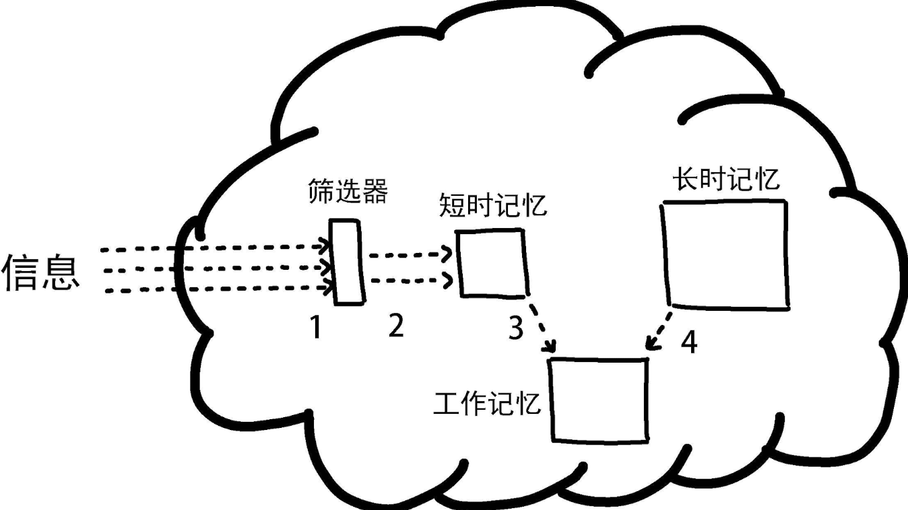

# 剖析程序设计之惑
## 阅读代码中遇到的三种困惑
- 缺乏知识, 不了解正在阅读的编程语言、算法或领域.
- 缺乏信息, 无法获得理解代码所需的全部信息, 尤其是如今的代码经常使用各种库、模块或包, 想读懂代码就需要检索大量信息, 而在收集新信息的同时还不能忘记原本应该完成的任务. 代码中看到一个接口不清楚他的作用是属于缺乏信息
- 缺乏加工能力, 代码有时过于复杂, 超出了大脑的加工能力.

## 影响程序设计的不同认知过程

- 长时记忆(long-term memory), 可以无限期存储所有记忆, 缺乏知识意味着长时记忆中缺少足够的相关事实. 长时记忆会存储几类相关的编程信息, 例如成功运用某种编程技巧的记忆、Java关键字的含义、英语单词的含义或者Java中int型变量的最大值(2147483647).
- 短时记忆(short-term memory), 大脑获取的信息暂时存储于短时记忆, 大脑接受外部的信息时, 不会直接进入长时记忆, 而是首先进入容量有限的短时记忆. 短时记忆的容量众说纷纭, 但是大多数科学家认为这种记忆只能存储少量的信息元素, 通常不会超过12个. 例如, 在阅读程序时, 大脑会把程序使用的关键字、变量名和数据结构暂时保存在短时记忆中.
- 工作记忆(working memory), 如果把长时记忆比做硬盘, 短时记忆比做内存, 那么工作记忆就相当于大脑的“处理器”. 在阅读代码的过程中, 大脑还会进行更多的活动. 程序员会尝试心算并梳理代码的执行结果, 这个过程称为**追踪**, 也就是在脑海里编译并执行代码. 大脑内部用于追踪以及进行其他复杂认知活动的机制称为工作记忆, 这种记忆相当于计算机用来执行计算任务的处理器. 如果大脑感觉需要借助外部媒介来存储信息, 则可能意味着工作记忆的负担过重, 难以加工更多的信息.

长时记忆、短时记忆、工作记忆这三种认知过程在阅读代码的过程中都会参与、相辅相成.

# 小节
- 缺乏知识会影响长时记忆.
- 缺乏信息会影响短时记忆.
- 缺乏加工能力会影响工作记忆.

# 快速阅读代码

提高快速查找相关信息的能力有助于减少反复浏览代码的次数. 如果代码阅读水平很高, 那么还可以降低浏览代码以查找其他信息的频率. 花在阅读代码方面的时间越少, 留给修复错误或者添加新功能的时间就越多, 程序员的效率因而越高.

## 快速阅读代码

## 弥补记忆容量不足的短板

既然缺乏信息会影响短时记忆, 因为短时记忆的容量十分有限. 想到提升短时记忆的容量并不容易, 我们更应该去提高自己把零散的小块变成组块(chunk), 虽然我们能够持有的信息素没有变, 但是单个信息元素包含的内容更丰富, 更集成, 更模块化

## 看到的代码比读到的代码多

